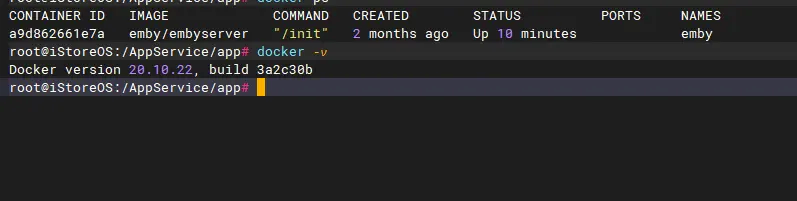

# Docker 安装
## Linux安装
> 推荐使用官方提供的脚本安装方式，一行代码解决出错概率小。

1. Ubuntu安装
```shell
 curl -fsSL https://test.docker.com -o test-docker.sh
 sudo sh test-docker.sh
```

2. Centos安装
```shell
curl -fsSL https://get.docker.com | bash -s docker --mirror Aliyun
```

3. 检查是否安装成功
> docker -v



4. Docker启动、关闭
```shell
sudo systemctl start docker
```
## Docker镜像加速(已过时-国内已禁止自建镜像站)
> 国内的环境大加懂得，没有加速很慢的。下面提供一些常用的docker加速地址，你也可以登录阿里云账号获取自己专属的加速地址。

- 科大镜像：**https://docker.mirrors.ustc.edu.cn/**
- 网易：**https://hub-mirror.c.163.com/**
- 阿里云：**https://<你的ID>.mirror.aliyuncs.com**
- 七牛云加速器：**https://reg-mirror.qiniu.com**
1. **ubuntu系统**
    1. **配置默认文件： /etc/default/docker**
```shell
DOCKER_OPTS="--registry-mirror=https://registry.docker-cn.com"
```

2. centos系统
    1. 配置默认地址： /etc/docker/daemon.json
```shell
{"registry-mirrors":["https://reg-mirror.qiniu.com/"]}
```
## 设置开机启动

1. 查看是否开机启动
```shell
systemctl list-unit-files | grep enabled
systemctl list-unit-files | grep enabled | grep docker
```

2. 设置开机启动
```shell
systemctl enable docker.service
```

3. 关机开机启动
```shell
systemctl disable docker.service
```
