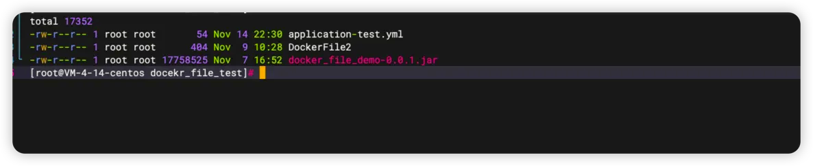
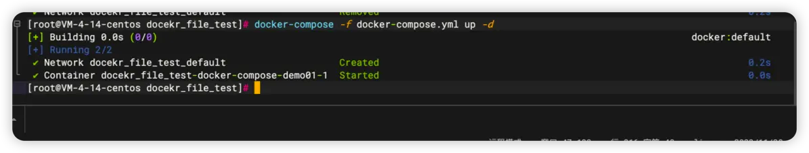

> 本篇实战文章会将DockerFile实战章节中的项目通过Docker-Compose来实现完成。

# 项目回顾
## 准备文件

## DockerFile2内容
```json
FROM fabletang/jre8-alpine

# 设定时区、中文

# 工作目录
WORKDIR /AppService

# 定义一个环境变量，后面看看通过java服务能否获取到
ENV TEST=测试


# 复制jar到工作目录中
COPY docker_file_demo-0.0.1.jar ./docker_file_demo_1.0.jar
COPY application-test.yml ./application-test.yml


CMD ["java", "-jar", "./docker_file_demo_1.0.jar","--spring.profiles.active=test"]
```
## application-test.yml
```json
applicationName: 你获取的是外部的配置文件
```
## 通过docker-compose构建服务
# Docker-Compose模板文件
## docker-compose.yml
```json
version: '3.0'

services:
  docker-compose-demo01:
    build:
      #构建的地址
      context: ./
      dockerfile: DockerFile2
    image: docker-compose-demo:1.0
    ports:
      - 8081:8080
    restart: always
    volumes:
      - /AppService/docker/docker_file/docekr_file_test/application-test.yml:/AppService/application-test.yml
```

## 测试结果
```json
[root@VM-4-14-centos docekr_file_test]# curl 127.0.0.1:8081/test1
你获取的是外部的配置文件
[root@VM-4-14-centos docekr_file_test]# 
```
