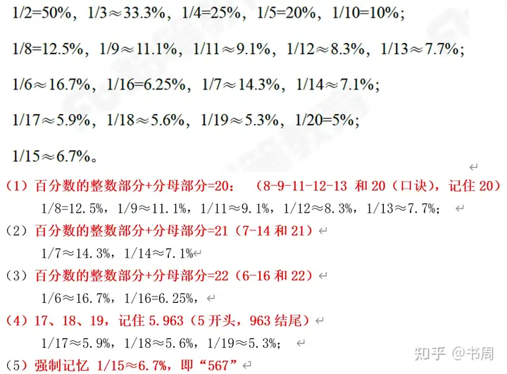

# 资料分析-速算篇

## 一、拆分法

* 乘法：127 * 234 = 127 * 200 + 127 * 30 + 127 * 4

* 加法：127 + 234 = 127 + 200 + 34

## 二、中间值法

* 124 - 137 = 124 - 130 - 7

  主要是找两个数之间的整数

## 三、截位直除

1. 初级

   差距大于10%，截2位；小于10%截3位。（四舍五入）

2. 高阶

* 差距大于10%，与初阶一致
* 差距小于10%大于5%，误差判断，通过分母截位后整体变大变小。
* 差距小于5%时，误差分析，通过分母截位后的误差率，得出总体的误差率加减上。（先判断误差是上升还是下降）。

## 四、错位法

1. 分子分母取前三位
2. 倍数增加
   * 分母增加前两位的n倍，分子也增加其自身前2位n倍。
   * 分母增加首位n倍，分子也增加首位n倍。
3. 不需要四舍五入

**注意**：

&nbsp;&nbsp;&nbsp;&nbsp;加减数据小于前两位一半，直接与首位对比倍数。如果大于前两位一半，先**加减前两位**  在加一个十位数和首位比较。

案例：1
$$
\frac{377}{216} = \frac{377 - 37 +6}{216 - 21 + 5}
(先减去前两位，在看5和首位的倍数)
$$

案例：2
$$
\\
\frac{324}{135} = \frac{324 + 32 +6 }{135 + 13 + 2 }
\\
$$

案例：3
$$
\\
\frac{314}{314} = \frac{314 + 31 + 9}{314 + 17 + 9}
$$

## 五、百化分

**四、包子除法**
$$
\frac{x}{128} = \frac{x}{12.8} = \frac{x}{1.28} (每次拿结果÷下一个包子)
$$
**五、倍数修正（二瑞误差法）**
$$
\frac{x}{y} = \frac{x + a}{y + b} 其中 \frac{x}{y} = \frac{a}{b}
\\
$$

1. 可以看b是分母的n倍，那么a也是分子的n倍。
2. 还可以看x是y的n倍，那么a也是b的n倍。

## 六、百化分

    在求增长量时可以使用百化分方法

$$ 
 \frac{现期值}{1 + 增长率} * 增长率 = \frac{A}{1 + r\%} * r\%
$$
这里可以将 r% 化成对应的分数。

