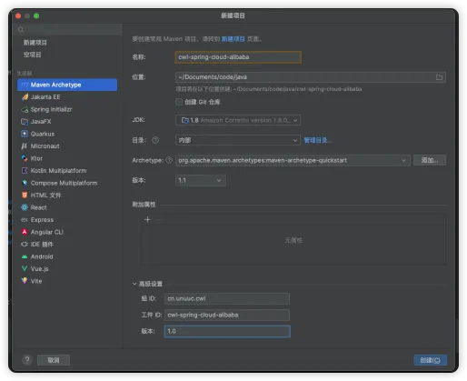

# 父模块项目搭建

## 创建一个空项目
> 删除自动创建的src文件夹，只保留一个pom文件


## 需改pom文件
```
<project xmlns="http://maven.apache.org/POM/4.0.0" xmlns:xsi="http://www.w3.org/2001/XMLSchema-instance"
         xsi:schemaLocation="http://maven.apache.org/POM/4.0.0 http://maven.apache.org/maven-v4_0_0.xsd">
    <modelVersion>4.0.0</modelVersion>

    <groupId>cn.unuuc.cwl</groupId>
    <artifactId>cwl-spring-cloud-alibaba</artifactId>
    <version>1.0</version>
    <packaging>pom</packaging>


    <name>cwl-spring-cloud-alibaba</name>
    <description>spring-cloud-alibaba study demo</description>
    <modules>
        <!--    库存    -->
        <module>integrated-storage</module>
        <!--    账户    -->
        <module>integrated-account</module>
        <!--    订单    -->
        <module>integrated-order</module>

        <module>nacos-config-demo</module>
    </modules>

    <properties>
        <project.build.sourceEncoding>UTF-8</project.build.sourceEncoding>
        <spring-cloud-alibaba.version>2.2.10-RC1</spring-cloud-alibaba.version>
        <spring-cloud.version>Hoxton.SR12</spring-cloud.version>
        <spring-boot.version>2.3.12.RELEASE</spring-boot.version>
        <lombok.version>1.18.30</lombok.version>
    </properties>

    <dependencyManagement>
        <dependencies>
            <dependency>
                <groupId>org.springframework.cloud</groupId>
                <artifactId>spring-cloud-dependencies</artifactId>
                <version>${spring-cloud.version}</version>
                <type>pom</type>
                <scope>import</scope>
            </dependency>
            <dependency>
                <groupId>com.alibaba.cloud</groupId>
                <artifactId>spring-cloud-alibaba-dependencies</artifactId>
                <version>${spring-cloud-alibaba.version}</version>
                <type>pom</type>
                <scope>import</scope>
            </dependency>
            <dependency>
                <groupId>org.springframework.boot</groupId>
                <artifactId>spring-boot-starter-parent</artifactId>
                <version>${spring-boot.version}</version>
                <type>pom</type>
                <scope>import</scope>
            </dependency>
            <dependency>
                <groupId>org.projectlombok</groupId>
                <artifactId>lombok</artifactId>
                <version>${lombok.version}</version>
            </dependency>
        </dependencies>
    </dependencyManagement>

</project>

```
## pom文件说明
```
 <dependency>
      <groupId>org.springframework.cloud</groupId>
      <artifactId>spring-cloud-dependencies</artifactId>
      <version>${spring-cloud.version}</version>
      <type>pom</type>
      <scope>import</scope>
  </dependency>
  <dependency>
      <groupId>com.alibaba.cloud</groupId>
      <artifactId>spring-cloud-alibaba-dependencies</artifactId>
      <version>${spring-cloud-alibaba.version}</version>
      <type>pom</type>
      <scope>import</scope>
  </dependency>
  <dependency>
      <groupId>org.springframework.boot</groupId>
      <artifactId>spring-boot-starter-parent</artifactId>
      <version>${spring-boot.version}</version>
      <type>pom</type>
      <scope>import</scope>
  </dependency>
```
这三个配置叫做版本仲裁，分别是springcloud、springcloud alibaba、springboot 的版本管理，通过在父pom文件中定义版本仲裁，子模块依赖其相关组件时不需要添加版本号。
