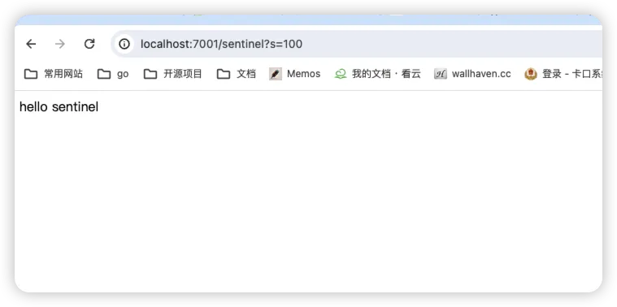
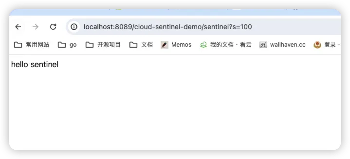
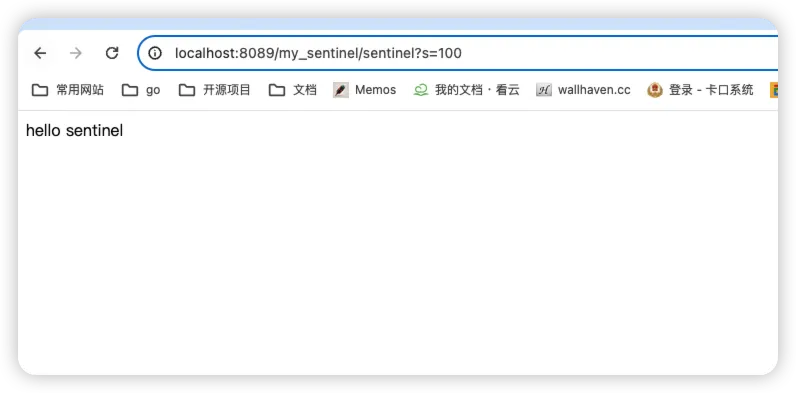

# GateWay 网关服务

## 新建cloud-gateway-demo服务
> gateway依赖

```
  <dependency>
      <groupId>org.springframework.cloud</groupId>
      <artifactId>spring-cloud-starter-gateway</artifactId>
  </dependency>
  
```
## 配置文件
```
server:
  port: 8089

spring:
  application:
    name: cloud-gateway-demo
  cloud:
    nacos:
      discovery:
        # 命名空间，用于区分不同的项目
        namespace: cwl
        # 服务注册地址
        server-addr: 192.168.101.104:8848
        username: nacos
        password: nacos
        # 是否注册服务到nacos
        enabled: true
    gateway:
      discovery:
        locator:
          enabled: true #开启注册中心路由功能


```

1. 不通过网关访问服务（这里还是用上一篇文章中的服务）



2. 通过网关调用sentinel服务（默认是通过nacos中的服务名称）



> [http://localhost:8089/cloud-sentinel-demo/sentinel?s=100](http://localhost:8089/cloud-sentinel-demo/sentinel?s=100) 其中cloud-sentinel-demo 为nacos中注册的服务名称，gateway会获取nacos中的服务具体ip并代理到

## 自定义路由配置

1. 修改bootstrap.yml
```
server:
  port: 8089

spring:
  application:
    name: cloud-gateway-demo
  cloud:
    nacos:
      discovery:
        # 命名空间，用于区分不同的项目
        namespace: cwl
        # 服务注册地址
        server-addr: 192.168.101.104:8848
        username: nacos
        password: nacos
        # 是否注册服务到nacos
        enabled: true
    gateway:
      discovery:
        locator:
          enabled: true #开启注册中心路由功能
      routes: # 路由
        - id: cloud-sentinel-demo #路由ID，没有固定要求，但是要保证唯一，建议配合服务名
          uri: lb://cloud-sentinel-demo # 匹配提供服务的路由地址
          predicates: # 断言
            - Path=/my_sentinel/** # 断言，路径相匹配进行路由
          filters:
            - StripPrefix=1 #去掉Path中前1个节点
```

2. 调用 [http://localhost:8089/my_sentinel/sentinel?s=100](http://localhost:8089/my_sentinel/sentinel?s=100) 



> ** ps: 这是网上说的，但是我没遇到，我开启关闭都可以 **
> ** 注意**：若要使用自定义配置，则**“不能开启注册中心的路由功能”**，否则自定义的策略会失效，学习时给我坑惨了，百度也没找到问题，解决注释了开启注册中心的路由功能的配置，自定义的配置就生效了。

## 路由配置说明
```
      routes: # 路由
        - id: cloud-sentinel-demo #路由ID，没有固定要求，但是要保证唯一，建议配合服务名
          uri: lb://cloud-sentinel-demo # 匹配提供服务的路由地址
          predicates: # 断言
            - Path=/my_sentinel/** # 断言，路径相匹配进行路由
          filters:
            - StripPrefix=1 #去掉Path中前1个节点
```

- id：确保唯一，一般都是服务名称
- uri:
   - lb: 表示开启负载均衡
   - cloud-sentinel-demo：这是注册到nacos中的服务名称，也是要调用的服务
- path: 当访问的地址匹配到时，gateway会转发到uri中配置的服务
- StripPrefix = 1 
   - 表示将访问的路径去掉前一个节点，比如访问地址[/my_sentinel/sentinel?s=100](http://localhost:8089/my_sentinel/sentinel?s=100) ，最终代理完整的路径为 [/cloud-sentinel-demo/sentinel?s=100](http://localhost:8089/my_sentinel/sentinel?s=100) 

