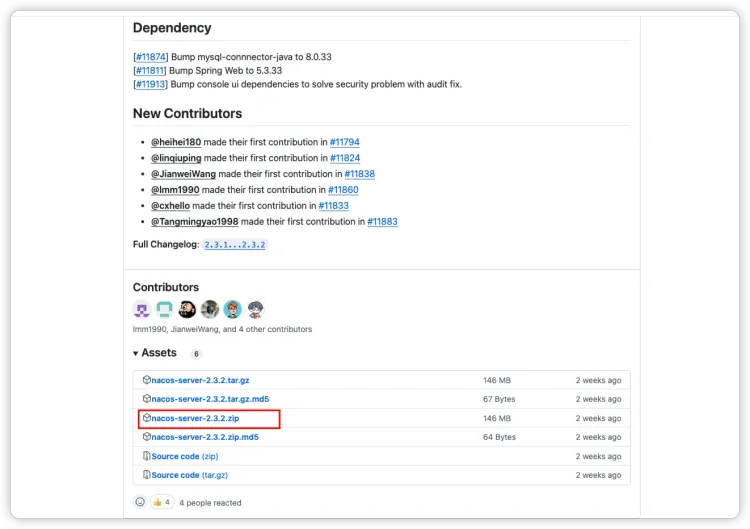
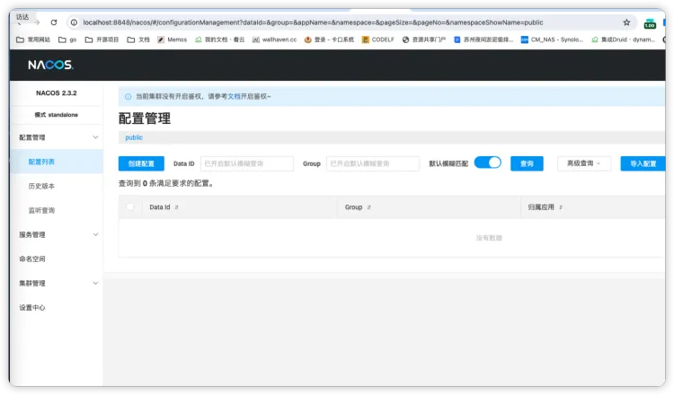

# Nacos 服务搭建

## 服务下载
[Releases · alibaba/nacos](https://github.com/alibaba/nacos/releases)


## 服务启动
下载后解压，进入到bin目录中，执行下面的名称（单机启动）
```
 sh ./startup.sh -m standalone   

```
## 查看服务
服务地址： [http://localhost:8848/nacos/#/](http://localhost:8848/nacos/#/)
默认密码 nacos/nacos


