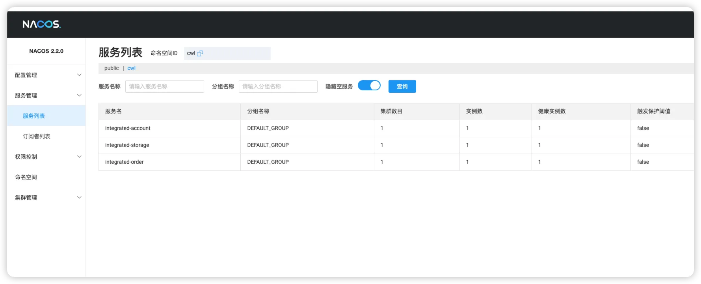

# 模拟案例服务

## 应用场景说明
> 这里使用spring cloud alibaba 文档中给业务场景，但是代码内容我个人编写的

[最佳实践示例](https://sca.aliyun.com/docs/2021/best-practice/integrated-example/)
### 用户下单购买货物场景

1. 先请求库存模块，扣减库存；
2. 扣减账户余额；
3. 生成订单信息返回响应。
## 创建三个服务并注册到Nacos中
> 具体创建过程就不记录了，代码最终上传到gitee代码仓库中

1. integrated-account: 用户模块
   1. 扣款余额功能，默认余额
2. integrated-order: 订单模块
   1. 当下单时，首先调用库存模块在调用用户模块，最后记录订单返回
3. integrated-storage: 库存模块
   1. 扣除库存数量功能

