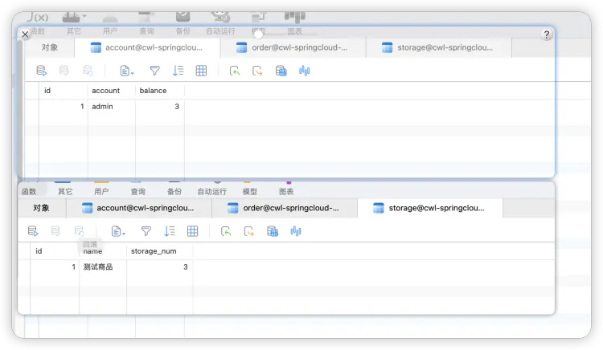
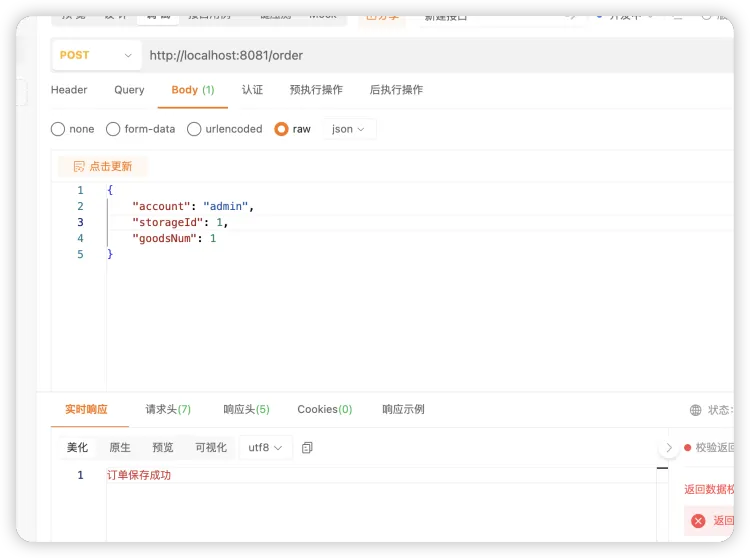
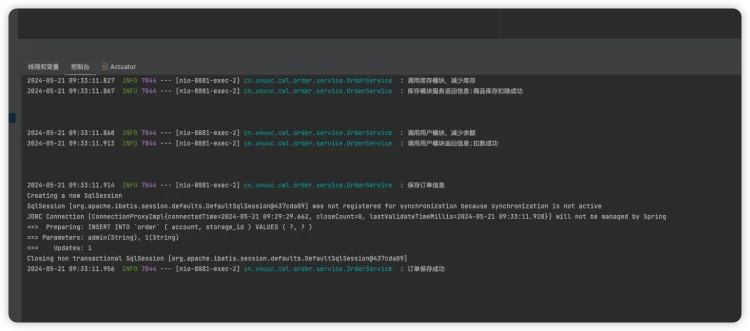

# OpenFeign 服务调用

> 上篇文章中创建3个服务，订单、库存、用户模块，其中库存扣款和用余额扣款功能已经开发并且三个服务都注册到nacos中。现在需要完善订单服务，通过OpenFeign远程调用库存服务和用户服务，从而完成一次订单功能。

## 订单服务整合OpenFeign

1. integrated-order 添加openFeign pom依赖
```
<dependency>
    <groupId>org.springframework.cloud</groupId>
    <artifactId>spring-cloud-starter-openfeign</artifactId>
</dependency>
```

2. 启动类添加@EnableFeignClients注解
```
@SpringBootApplication
@EnableDiscoveryClient
@EnableFeignClients
public class OrderApplication {

    public static void main(String[] args) {
        SpringApplication.run(OrderApplication.class, args);
    }
}
```

3. 如果在项目中把openfeign模块提取为公共的模块，但是包路径不一样，可以在注解中指定包路径
```
@SpringBootApplication
@EnableDiscoveryClient
@EnableFeignClients(basePackages = "com.alibaba.provider.feigns")
public class OrderApplication {

    public static void main(String[] args) {
        SpringApplication.run(OrderApplication.class, args);
    }
}
```

> 这里我为了方便把integrated-account、integrated-storage两个服务中的AccountQo和StorageQo复制到了integrated-order项目中。

## 创建AccountOpenFeignService接口
> 用户定义OpenFeign远程调用integrated-account服务提供的服务

```
@FeignClient(value = "integrated-account")
public interface AccountOpenFeignService {


    /**
     * 远程调用服务，减少指定用户的余额
     */
    @RequestMapping(value = "/account", method = RequestMethod.POST)
    String deductMoney(AccountQo accountQo);

}
```

1. @FeignClient 注解：修饰在接口类上，value 内容为服务名称（在nacos控制台显示的服务），OpenFeign会根据nacos获取服务信息进行调用
## 创建StorageOpenFeignService接口
> 同AccountOpenFeignService一样

```
@FeignClient(value = "integrated-storage")
public interface StorageOpenFeignService {

    /**
     * 远程调用服务，减少指定商品库存
     */
    @RequestMapping(value = "/account", method = RequestMethod.POST)
    String deductStorage(StorageQo storageQo);
}
```
## 完善OrderService服务
> 当处理订单请求时，首先调用库存模块进行减少，在调用用户模块减少余额。默认用户余额3，商品价格2。

注意：order是MYSQL关键字，需要在实体类中@TableName("`order`")
```
@Service
@Slf4j
public class OrderService extends ServiceImpl<OrderMapper, Order> {


    @Resource
    private AccountOpenFeignService accountOpenFeignService;

    @Resource
    private StorageOpenFeignService storageOpenFeignService;


    public String saveOrder(OrderQo orderQo) {
        log.info("调用库存模块，减少库存");
        StorageQo storageQo = new StorageQo();
        storageQo.setStorageId(Long.valueOf(orderQo.getStorageId()));
        storageQo.setDeductNum(orderQo.getGoodsNum());
        String storageResult = storageOpenFeignService.deductStorage(storageQo);
        log.info("库存模块服务返回信息:{}", storageResult);
        System.out.println("\n\n");
        log.info("调用用户模块，减少余额");
        AccountQo accountQo = new AccountQo();
        accountQo.setAccount(orderQo.getAccount());
        accountQo.setDeductMoney((double) (orderQo.getGoodsNum() * 2));
        String accountResult = accountOpenFeignService.deductMoney(accountQo);
        log.info("调用用户模块返回信息:{}", accountResult);
        System.out.println("\n\n");

        log.info("保存订单信息");
        Order order = new Order();
        order.setAccount(orderQo.getAccount());
        order.setStorageId(orderQo.getStorageId());
        this.baseMapper.insert(order);
        log.info("订单保存成功");
        return "订单保存成功";
    }

}
```
## 调用订单接口测试
> `http://localhost:8081/order`  POST

1. 当前库存为3，用户余额为3



2. 调用order服务，下发订单




## 思考
如果再次调用会发生什么，目前库存2，余额1，

1. 库存模块减少1，库存剩余1
2. 用户用户模块减少2，余额模块异常
3. 此时会发现，虽然用户模块异常，但是库存却已经减少了，这就需要引入分布式事务来解决。
