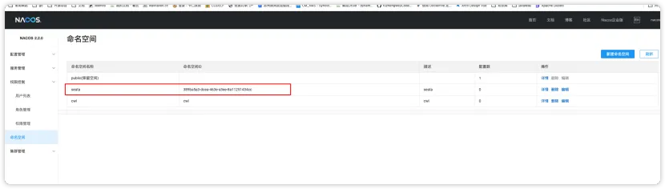

# Seata 服务端安装

参考文章
[Just a moment...](https://blog.csdn.net/cl617287/article/details/131974640)
## 下载地址
> 我下载的版本是 seata-server-1.6.1.tar.gz

[Releases · apache/incubator-seata](https://github.com/apache/incubator-seata/releases)
## 上传解压
```
tar -zxvf ./seata-server-1.6.1.tar.gz 
```

## 创建seata数据库
> 这里我使用mysql作为数据源，数据库文件在解压目录下的  script/server/db/mysql.sql


## Nacos新建命名空间
> 命名空间id: 389ba5a3-dcea-463e-a3ee-8a11251434cc ,自动生成，后面配置需要使用到这个值


## 修改相关配置文件
### application.yml
> 文件在conf目录下，主要修改nacos和db的配置，这里需要根据自己的环境进行配置

```
#  Copyright 1999-2019 Seata.io Group.
#
#  Licensed under the Apache License, Version 2.0 (the "License");
#  you may not use this file except in compliance with the License.
#  You may obtain a copy of the License at
#
#  http://www.apache.org/licenses/LICENSE-2.0
#
#  Unless required by applicable law or agreed to in writing, software
#  distributed under the License is distributed on an "AS IS" BASIS,
#  WITHOUT WARRANTIES OR CONDITIONS OF ANY KIND, either express or implied.
#  See the License for the specific language governing permissions and
#  limitations under the License.

server:
  port: 7091

spring:
  application:
    name: seata-server

logging:
  config: classpath:logback-spring.xml
  file:
    path: ${user.home}/logs/seata
  extend:
    logstash-appender:
      destination: 127.0.0.1:4560
    kafka-appender:
      bootstrap-servers: 127.0.0.1:9092
      topic: logback_to_logstash

console:
  user:
    username: seata
    password: seata

seata:
  config:
    # support: nacos, consul, apollo, zk, etcd3
    type: nacos
    nacos:
      server-addr: 192.168.101.104:8848
      namespace: 389ba5a3-dcea-463e-a3ee-8a11251434cc
      group: SEATA_GROUP
      username: nacos
      password: nacos
  registry:
    # support: nacos, eureka, redis, zk, consul, etcd3, sofa
    type: nacos
    nacos:
      application: seata-server
      server-addr: 192.168.101.104:8848
      group: SEATA_GROUP
      namespace: 389ba5a3-dcea-463e-a3ee-8a11251434cc
      username: nacos
      password: nacos
  store:
    # support: file 、 db 、 redis
    mode: db
    db:
      datasource: druid
      db-type: mysql
      driver-class-name: com.mysql.jdbc.Driver
      url: jdbc:mysql://192.168.101.104:3306/seata?rewriteBatchedStatements=true
      user: root
      password: cwljxf1025.
      min-conn: 10
      max-conn: 100
      global-table: global_table
      branch-table: branch_table
      lock-table: lock_table
      distributed-lock-table: distributed_lock
      query-limit: 1000
      max-wait: 5000
#  server:
#    service-port: 8091 #If not configured, the default is '${server.port} + 1000'
  security:
    secretKey: SeataSecretKey0c382ef121d778043159209298fd40bf3850a017
    tokenValidityInMilliseconds: 1800000
    ignore:
      urls: /,/**/*.css,/**/*.js,/**/*.html,/**/*.map,/**/*.svg,/**/*.png,/**/*.ico,/console-fe/public/**,/api/v1/auth/login
```
### 修改config.txt
> script/config-center/下的config.txt文件, 修改db相关的配置即可


## 将相关配置导入到nacos中
> /script/config-center/nacos/

进入到相关目录后执行命令

```
-h nacos的ip
-p nacos的端口
-t 刚才nacos空间id
-u nacos的登录用户
-w nacos的登录密码

bash nacos-config.sh -h 192.168.101.104 -p 8848 -g SEATA_GROUP -t 389ba5a3-dcea-463e-a3ee-8a11251434cc -u nacos -w nacos
```

## 启动seata
> 进入seata/bin目录

```
bash ./seata-server.bat

建议使用下面的命令
bash ./seata-server.bat -h "自己的IP" -p 8091
```
**访问7091端口**

> seata服务端已经搭建完毕

