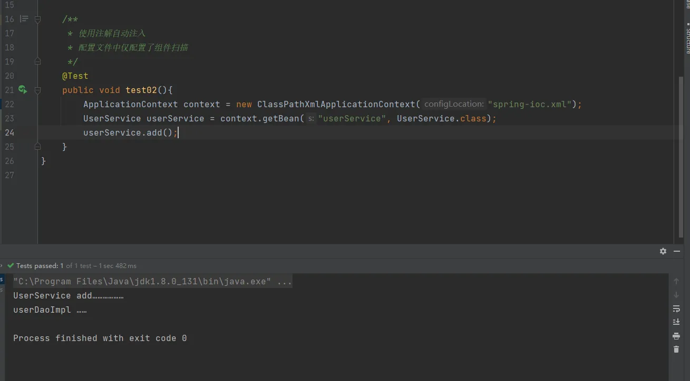
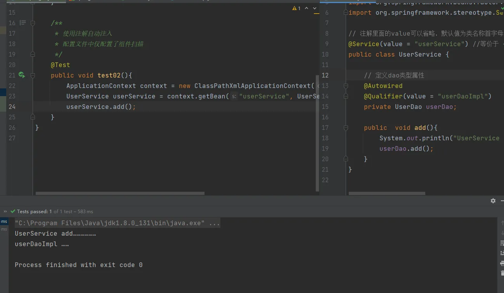
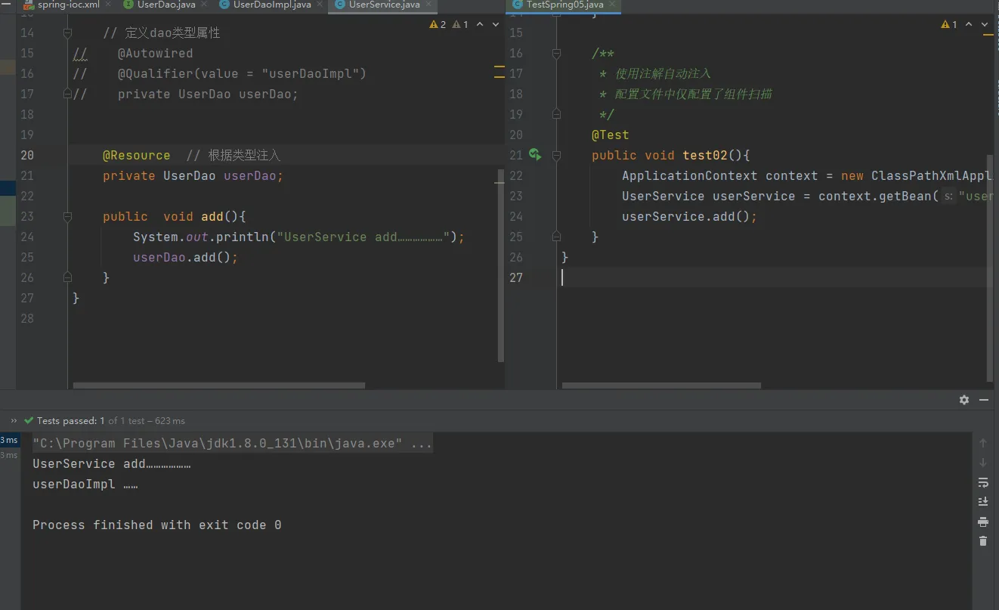
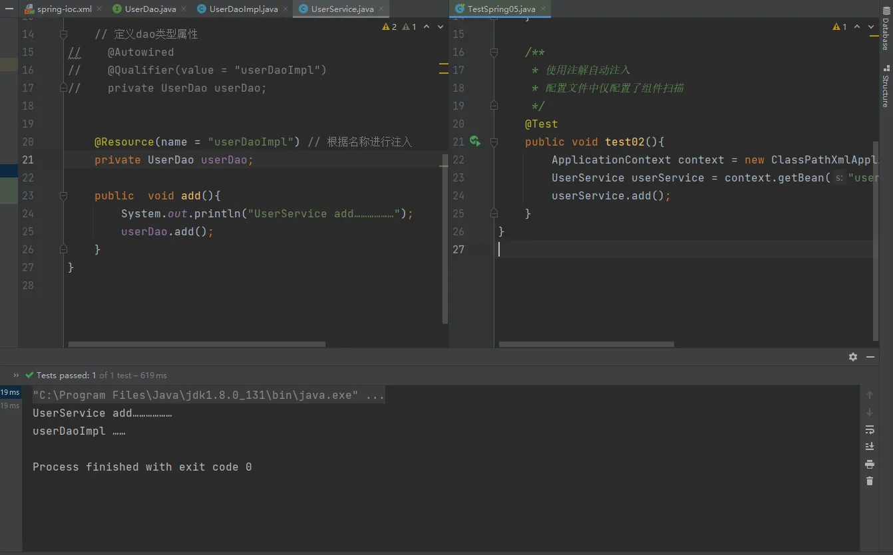
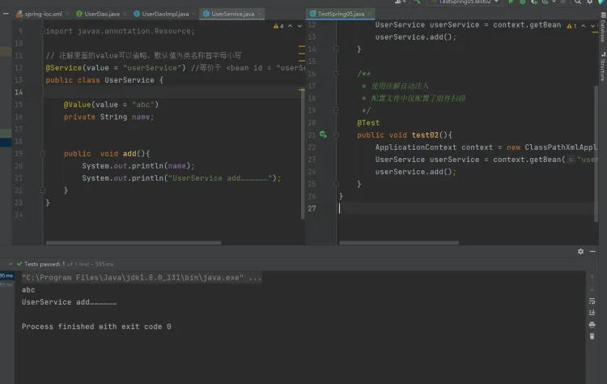

# IOC (注解 bean 管理) 注入属性

## 注入属性的三个常用注解
1. `@Autowired` ：根据属性类型进行自动注入
2. `@Qualifier` ：根据属性名称进行自动注入
3. `@Resource` ：可以根据类型注入，也可以根据名称注入（**该注解是javax(扩张包)里提供的注解**）
4. `@Value` ：针对普通类型属性

**注意：前三个注解都是针对对象属性进行注入**
## 代码案例
创建UserDao和UserDaoimpl
```java
package cn.unuuc.spring05.dao;

public interface UserDao {
    public void add();
}

```
```java
package cn.unuuc.spring05.dao;

import org.springframework.stereotype.Repository;


public class UserDaoImpl implements UserDao{
    @Override
    public void add() {
        System.out.println("userDaoImpl ……");
    }
}
```
### 根据 `@Autowired` 根据属性类型进行自动装配
一、把service和dao对象创建，在service和dao类添加对象注解
二、在service注入dao对象，在service类添加dao类型属性，在属性上面使用注解
```java
@Repository
public class UserDaoImpl implements UserDao{
    @Override
    public void add() {
        System.out.println("userDaoImpl ……");
    }
}
```
```java
package cn.unuuc.spring05.service;

import cn.unuuc.spring05.dao.UserDao;
import org.springframework.beans.factory.annotation.Autowired;
import org.springframework.stereotype.Service;

// 注解里面的value可以省略，默认值为类名称首字母小写
@Service(value = "userService") //等价于 <bean id = "userService" class="……"/>
public class UserService {

    // 定义dao类型属性
    // 不需要添加set方法
    @Autowired
    private UserDao userDao;

    public  void add(){
        System.out.println("UserService add………………");
        userDao.add();
    }
}
```
**在创建对象的时候添加在具体实现类上，不是添加在接口上**
**测试：**



### `@Qualifier` 根据属性名称进行注入
该注解需要和 `@Autowired` 一起使用，

如果一个接口它有多个实现类，在进行自动注入的时候无法根据属性自动注入，因为有多个相同类型的对象在ioc容器类，这时候就需要 `@Qualifier` 注解来根据指定名称进行注入。
如上面案例：
```java
package cn.unuuc.spring05.service;

import cn.unuuc.spring05.dao.UserDao;
import org.springframework.beans.factory.annotation.Autowired;
import org.springframework.beans.factory.annotation.Qualifier;
import org.springframework.stereotype.Service;

// 注解里面的value可以省略，默认值为类名称首字母小写
@Service(value = "userService") //等价于 <bean id = "userService" class="……"/>
public class UserService {

    // 定义dao类型属性
    @Autowired
    @Qualifier(value = "userDaoImpl")// 注入useDaoImpl这个对象
    private UserDao userDao;

    public  void add(){
        System.out.println("UserService add………………");
        userDao.add();
    }
}

```
**测试结果：**



### `@Resource` 根据类型或名称注入
**根据类型**
```java
package cn.unuuc.spring05.service;

import cn.unuuc.spring05.dao.UserDao;
import org.springframework.beans.factory.annotation.Autowired;
import org.springframework.beans.factory.annotation.Qualifier;
import org.springframework.stereotype.Service;

import javax.annotation.Resource;

// 注解里面的value可以省略，默认值为类名称首字母小写
@Service(value = "userService") //等价于 <bean id = "userService" class="……"/>
public class UserService {

    @Resource // 根据类型进行注入
    private UserDao userDao;

    public  void add(){
        System.out.println("UserService add………………");
        userDao.add();
    }
}

```



**根据名称**
```java
package cn.unuuc.spring05.service;

import cn.unuuc.spring05.dao.UserDao;
import org.springframework.beans.factory.annotation.Autowired;
import org.springframework.beans.factory.annotation.Qualifier;
import org.springframework.stereotype.Service;

import javax.annotation.Resource;

// 注解里面的value可以省略，默认值为类名称首字母小写
@Service(value = "userService") //等价于 <bean id = "userService" class="……"/>
public class UserService {

    @Resource(name = "userDaoImpl") // 根据名称进行注入
    private UserDao userDao;

    public  void add(){
        System.out.println("UserService add………………");
        userDao.add();
    }
}

```



### `@Value` 基本类型注入
```java
package cn.unuuc.spring05.service;

import cn.unuuc.spring05.dao.UserDao;
import org.springframework.beans.factory.annotation.Autowired;
import org.springframework.beans.factory.annotation.Qualifier;
import org.springframework.beans.factory.annotation.Value;
import org.springframework.stereotype.Service;

import javax.annotation.Resource;

// 注解里面的value可以省略，默认值为类名称首字母小写
@Service(value = "userService") //等价于 <bean id = "userService" class="……"/>
public class UserService {

    @Value(value = "abc")
    private String name;


    public  void add(){
        System.out.println(name);
        System.out.println("UserService add………………");
    }
}
```



