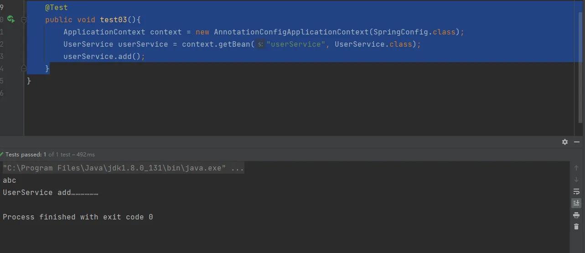

# IOC (注解 bean 管理) 纯注解开发

1. 创建配置类，替代xml配置文件 `@Configurable` 
```java
package cn.unuuc.spring05.config;

import org.springframework.beans.factory.annotation.Configurable;

@Configurable // 作为配置类，替代xml配置文件
public class SpringConfig {
    
}

```

2. 在配置类中开启组件扫描 `@ComponentScan` 
```java
package cn.unuuc.spring05.config;

import org.springframework.beans.factory.annotation.Configurable;
import org.springframework.context.annotation.ComponentScan;

@Configuration
@ComponentScan(basePackages = {"cn.unuuc.spring05"})
public class SpringConfig {

}

```
**此时就不需要配置文件**

3. 测试方法（有所不同）
```java
    @Test
    public void test03(){
        ApplicationContext context = new AnnotationConfigApplicationContext(SpringConfig.class);
        UserService userService = context.getBean("userService", UserService.class);
        userService.add();
    }
```
**此时加载的不是配置文件，而是配置类，其它都是一样的。**




