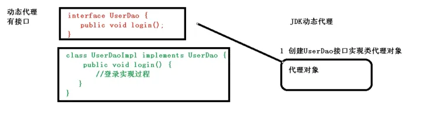
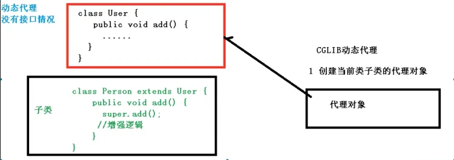
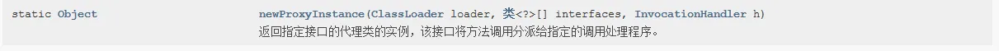
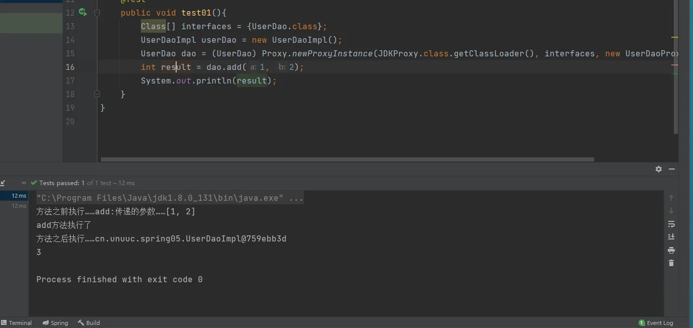

# AOP 基本概念、底层原理、术语

## 什么是AOP
1. 面向切面编程，利用AOP可以对业务逻辑的各个部分进行隔离，从而使得业务逻辑各部分之间的耦合度降低，提高程序的可重用性，同时提高了开发的效率。
2. 通俗话语：不通过修改源代码的方式，在主干功能里添加新功能。
# AOP底层原理（动态代理）

1. AOP底层使用动态代理

（1）有两种情况动态代理：

第一种、 有接口情况，使用JDK动态代理
**创建接口实现类代理对象，增强类的方法**



第二种、 没有接口情况，使用CGLIB动态代理
**创建子类的代理对象，增强类的方法**



# JDK动态代理代码编写

1. 使用JDK动态代理，使用 `Proxy` 类里面的方法创建代理对象

（1）调用 `newProxyInstance` 方法



方法内三个参数：
第一参数：类加载器
第二参数：增强方法所在的类，这个类实现的接口，支持多个接口
第三参数：实现这个接口 `InvocationHandler` ，创建代理对象，写增强方法

2. 代码实现

（1）创建接口，定义方法
```java
package cn.unuuc.spring05;

public interface UserDao {
    
    int add(int a,int b);
    
    String update(String id);
}
```
（2）创建接口实现类，实现方法
```java
package cn.unuuc.spring05;

public class UserDaoImpl implements UserDao{
    
    @Override
    public int add(int a, int b) {
        System.out.println("add方法执行了");
        return a+b;
    }

    @Override
    public String update(String id) {
        System.out.println("update方法执行了");
        return id;
    }
}
```
（3）使用InvocationHandler接口的实现类，用来进行增强的内容
```java
package cn.unuuc.spring05;

import java.lang.reflect.InvocationHandler;
import java.lang.reflect.Method;
import java.util.Arrays;

// 创建代理对象代码
public class UserDaoProxy implements InvocationHandler {

    private Object obj;

    // 把创建的是 谁 的代理对象，把 谁 传递过来
    // 通过有参构造
    public UserDaoProxy(Object obj){
        this.obj = obj;
    }

    // 增强的逻辑
    @Override
    public Object invoke(Object proxy, Method method, Object[] args) throws Throwable {
        // 方法之前
        System.out.println("方法之前执行……"+method.getName()+":传递的参数……"+ Arrays.toString(args));
        // 被增强的方法执行
        Object res = method.invoke(obj, args);
        // 方法之后
        System.out.println("方法之后执行……"+obj);
        return res;
    }
}
```
（4）测试方法
```java
    @Test
    public void test01(){
        Class[] interfaces = {UserDao.class};
        UserDaoImpl userDao = new UserDaoImpl();
        UserDao dao = (UserDao) Proxy.newProxyInstance(JDKProxy.class.getClassLoader(), interfaces, new UserDaoProxy(userDao));
        int result = dao.add(1, 2);
        System.out.println(result);
    }
```

## 术语

1. **连接点**：类里面哪些方法可以被增强，这些方法称为连接点

2. **切入点**：实际被真正增强的方法，称为切入点

3. **通知（增强）**：
   - 增强的逻辑代码部分被称为通知（增强）
   - 通知多种类型：前置通知、后置通知、环绕通知、异常通知、最终通知

4. **切面**：把通知应用到切入点的过程，它只是一个动作
