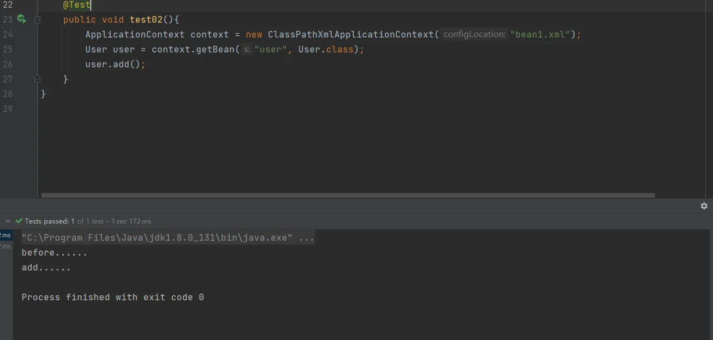
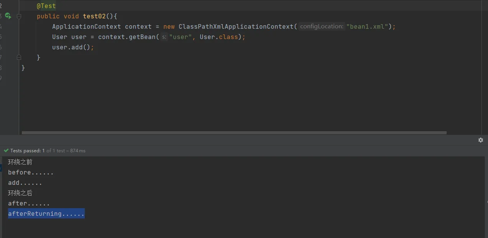
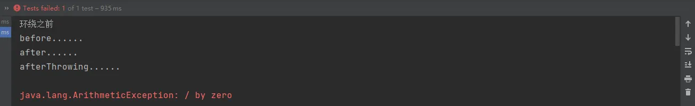
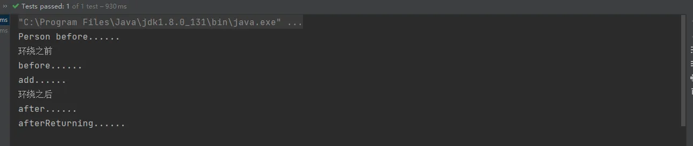

# AOP 操作（AspectJ 注解）常用

1. 创建类，在类里面定义方法
```java
package cn.unuuc.spring05.aopanno;

public class User {
    public void add(){
        System.out.println("add......");
    }
}
```

2. 创建增强类（编写增强逻辑）

（1）在类里面，创建方法，让不同方法代表不同通知类型
```java
package cn.unuuc.spring05.aopanno;

//增强的类
public class UserProxy {

    //作为前置通知
    public void before(){
        System.out.println("before......");
    }
}
```

3. 进行通知的配置

（1）在Spring配置文件中，开启注解扫描（需要引入命名空间context、aop）
```xml
<?xml version="1.0" encoding="UTF-8"?>
<beans xmlns="http://www.springframework.org/schema/beans"
       xmlns:xsi="http://www.w3.org/2001/XMLSchema-instance"
       xmlns:context="http://www.springframework.org/schema/context"
       xmlns:aop="http://www.springframework.org/schema/aop"
       xsi:schemaLocation="http://www.springframework.org/schema/beans http://www.springframework.org/schema/beans/spring-beans.xsd
        http://www.springframework.org/schema/context  http://www.springframework.org/schema/context/spring-context.xsd
              http://www.springframework.org/schema/aop  http://www.springframework.org/schema/aop/spring-aop.xsd">

    <!--开启注解扫描-->
    <context:component-scan base-package="cn.unuuc.spring05.aopanno"></context:component-scan>
  
</beans>
```
（2）使用注解创建User和UserProxy对象
```java
//增强的类
@Component
public class UserProxy {

    //作为前置通知
    public void before(){
        System.out.println("before......");
    }
}
```
```java
@Component
public class User {
    public void add(){
        System.out.println("add......");
    }
}

```
（3）在增强类上添加注解 `@Aspect` 
```java
//增强的类
@Component
@Aspect // 表示生成代理对象
public class UserProxy {

    //作为前置通知
    public void before(){
        System.out.println("before......");
    }
}
```
（4）在spring配置文件中开启生产代理对象
```xml
<?xml version="1.0" encoding="UTF-8"?>
<beans xmlns="http://www.springframework.org/schema/beans"
       xmlns:xsi="http://www.w3.org/2001/XMLSchema-instance"
       xmlns:context="http://www.springframework.org/schema/context"
       xmlns:aop="http://www.springframework.org/schema/aop"
       xsi:schemaLocation="http://www.springframework.org/schema/beans http://www.springframework.org/schema/beans/spring-beans.xsd
        http://www.springframework.org/schema/context  http://www.springframework.org/schema/context/spring-context.xsd
              http://www.springframework.org/schema/aop  http://www.springframework.org/schema/aop/spring-aop.xsd">

    <!--开启注解扫描-->
    <context:component-scan base-package="cn.unuuc.spring05.aopanno"></context:component-scan>

    <!--开启Aspect生产代理对象-->
    <aop:aspectj-autoproxy></aop:aspectj-autoproxy>

</beans>
```
4. 配置不同类型的通知
（1）在增强类的里面，在作为通知方法上面添加通知类型注解，使用切入点表达式
```java
package cn.unuuc.spring05.aopanno;

import org.aspectj.lang.annotation.Aspect;
import org.aspectj.lang.annotation.Before;
import org.springframework.stereotype.Component;

//增强的类
@Component
@Aspect // 表示生产代理对象
public class UserProxy {

    //作为前置通知
    @Before(value = "execution(* cn.unuuc.spring05.aopanno.User.add(..))")
    public void before(){
        System.out.println("before......");
    }
}
```

5. 测试



## 其它通知
```java
package cn.unuuc.spring05.aopanno;

import org.aspectj.lang.ProceedingJoinPoint;
import org.aspectj.lang.annotation.*;
import org.springframework.stereotype.Component;

//增强的类
@Component
@Aspect // 表示生产代理对象
public class UserProxy {

    //作为前置通知
    @Before(value = "execution(* cn.unuuc.spring05.aopanno.User.add(..))")
    public void before(){
        System.out.println("before......");
    }
    // 后置通知/返回值通知
    @AfterReturning(value = "execution(* cn.unuuc.spring05.aopanno.User.add(..))")
    public void afterReturning(){
        System.out.println("afterReturning......");
    }
    // 异常通知
    @AfterThrowing(value = "execution(* cn.unuuc.spring05.aopanno.User.add(..))")
    public void afterThrowing(){
        System.out.println("afterThrowing......");
    }
    // 最终同hi
    @After(value = "execution(* cn.unuuc.spring05.aopanno.User.add(..))")
    public void after(){
        System.out.println("after......");
    }
    
    // 环绕通知
    @Around(value = "execution(* cn.unuuc.spring05.aopanno.User.add(..))")
    public void around(ProceedingJoinPoint proceedingJoinPoint) throws Throwable {
        System.out.println("环绕之前");

        // 被增强的方法执行
        Object proceed = proceedingJoinPoint.proceed();

        System.out.println("环绕之后");
    }
}
```


注意每个通知执行的前后顺序
after:方法之后执行
afterReturning:方法返回值之后执行

1. 模拟异常



环绕之后没有执行
afterReturning（后置通知/返回通知）没有执行

**after:被称为最终通知，无论什么情况下都会执行**
## 切入点表达式代码抽取
```java
package cn.unuuc.spring05.aopanno;

import org.aspectj.lang.ProceedingJoinPoint;
import org.aspectj.lang.annotation.*;
import org.springframework.stereotype.Component;

//增强的类
@Component
@Aspect // 表示生产代理对象
public class UserProxy {

    @Pointcut(value = "execution(* cn.unuuc.spring05.aopanno.User.add(..))")
    public void pointcut(){
        
    }
    
    //作为前置通知
    @Before(value = "pointcut()")
    public void before(){
        System.out.println("before......");
    }
}
```
## 多个增强类对同一个方法进行增强
**可以对增强类进行设置优先级**

1. 在创建一个增强类
```java
package cn.unuuc.spring05.aopanno;

import org.aspectj.lang.annotation.Aspect;
import org.aspectj.lang.annotation.Before;
import org.springframework.stereotype.Component;

@Component
@Aspect
public class PersonProxy {

    //作为前置通知
    @Before(value = "execution(* cn.unuuc.spring05.aopanno.User.add(..))")
    public void before(){
        System.out.println("Person before......");
    }
}
```

2. 在增强类上面添加注解 `@Order（int）` 数字类型的值越小优先级越高
```java
package cn.unuuc.spring05.aopanno;

import org.aspectj.lang.annotation.Aspect;
import org.aspectj.lang.annotation.Before;
import org.springframework.core.annotation.Order;
import org.springframework.stereotype.Component;

@Component
@Aspect
@Order(1)
public class PersonProxy {

    //作为前置通知
    @Before(value = "execution(* cn.unuuc.spring05.aopanno.User.add(..))")
    public void before(){
        System.out.println("Person before......");
    }
}
```

3. 在对UserProxy设置 `@Order` 为3，对PersonProxy设置 `@Order` 为1,进行测试




**可以看到，PersonProxy里的增强方法是首先执行的**
