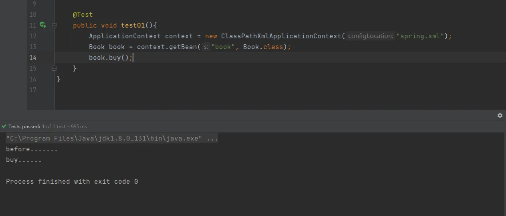

# AOP 操作（AspectJ xml )

1. 创建两个类，增强类和被增强类，创建方法、
```java
package cn.unuuc.spring5.aopxml;

public class Book {

    public void buy(){
        System.out.println("buy......");
    }
}
```
```java
package cn.unuuc.spring5.aopxml;

public class BookProxy {

    public void before(){
        System.out.println("before.......");
    }
}
```

2. 在spring配置文件中创建两个类对象
```xml
<?xml version="1.0" encoding="UTF-8"?>
<beans xmlns="http://www.springframework.org/schema/beans"
       xmlns:xsi="http://www.w3.org/2001/XMLSchema-instance"
       xmlns:context="http://www.springframework.org/schema/context"
       xmlns:aop="http://www.springframework.org/schema/aop"
       xsi:schemaLocation="http://www.springframework.org/schema/beans http://www.springframework.org/schema/beans/spring-beans.xsd
       http://www.springframework.org/schema/context  http://www.springframework.org/schema/context/spring-context.xsd
       http://www.springframework.org/schema/aop  http://www.springframework.org/schema/aop/spring-aop.xsd">
    
    <!--创建对象-->
    <bean id="book" class="cn.unuuc.spring5.aopxml.Book"></bean>
    <bean id="bookProxy" class="cn.unuuc.spring5.aopxml.BookProxy"></bean>
    
</beans>
```

3. 在spring配置文件中配置切入点
```xml
<?xml version="1.0" encoding="UTF-8"?>
<beans xmlns="http://www.springframework.org/schema/beans"
       xmlns:xsi="http://www.w3.org/2001/XMLSchema-instance"
       xmlns:context="http://www.springframework.org/schema/context"
       xmlns:aop="http://www.springframework.org/schema/aop"
       xsi:schemaLocation="http://www.springframework.org/schema/beans http://www.springframework.org/schema/beans/spring-beans.xsd
       http://www.springframework.org/schema/context  http://www.springframework.org/schema/context/spring-context.xsd
       http://www.springframework.org/schema/aop  http://www.springframework.org/schema/aop/spring-aop.xsd">

    <!--创建对象-->
    <bean id="book" class="cn.unuuc.spring5.aopxml.Book"></bean>
    <bean id="bookProxy" class="cn.unuuc.spring5.aopxml.BookProxy"></bean>

    <!--aop的增强-->
    <aop:config>
        <!--切入点表达式-->
        <aop:pointcut id="p" expression="execution(* cn.unuuc.spring5.aopxml.Book.buy(..))"/>
        
        <!--配置切面-->
        <aop:aspect ref="bookProxy">
            <!--增强作用在具体的方法上-->
            <aop:before method="before" pointcut-ref="p"></aop:before>
            <!--配置其它类型的通知-->
        </aop:aspect>
        
    </aop:config>
</beans>
```



**xml开发不需要开启代理对象，默认开启**
## AspectJ完全注解开发
```java
package cn.unuuc.spring5.config;

import org.springframework.context.annotation.ComponentScan;
import org.springframework.context.annotation.Configuration;
import org.springframework.context.annotation.EnableAspectJAutoProxy;

@Configuration
@ComponentScan(basePackages = {"cn.unuuc.spring5"})
@EnableAspectJAutoProxy(proxyTargetClass = true)// 开启AspectJ代理对象
public class ConfigSpring {
}
```

