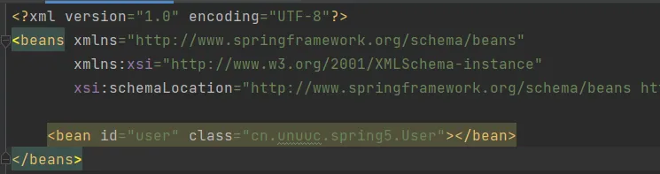
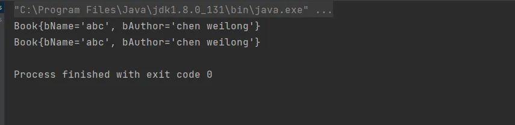
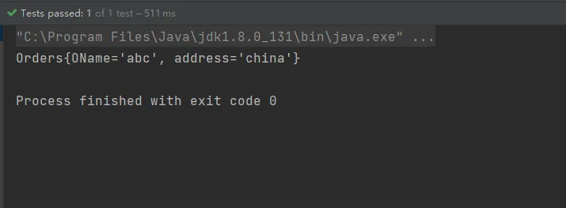
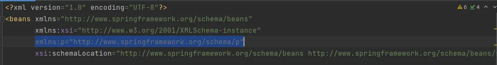
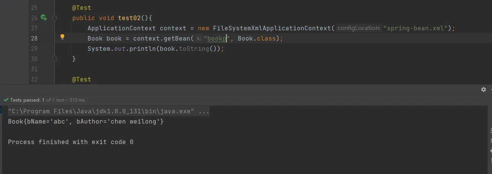

# IOC（xml bean 管理）创建对象，DI注入基本属性

## 什么是IOC
1. 控制反转，把对象创建和对象之间的调用过程，交给Spring进行管理
2. 使用IOC的目的：为了耦合度降低
3. 入门案例就是IOC实现

## IOC底层原理
xml解析、工厂设计模式、反射
## IOC(接口)

1. IOC思想基于IOC容器完成，IOC容器底层就是对象工厂
2. Spring提供了IOC容器实现两种方式：（两种接口）
   1. BeanFactory：IOC容器基本实现，时spring内部的使用接口，一般不提供开发人员进行使用
      1. 加载配置文件时不会创建对象，而是在获取（使用）的时候才会创建对象
   2. ApplicationContext：BeanFactory接口的子接口，提供了更多更强大的功能，一般是由开发人员进行使用
      1. 加载配置文件的时候就会创建对象（在配置文件中配置的对象）。

## IOC操作Bean管理

1. 什么是Bean管理
   1. Spring创建对象
   2. Spring注入属性
2. Bean管理操作有两种方式
   1. 基于xml配置文件方式实现
   2. 基于出街方式实现

## IOC操作Bean管理（基于xml方式）

### 基于xml方式创建对象



1. 在spring配置文件中，使用bean标签，标签里添加对应属性，就可以实现对象创建
2. 在bean标签中有很多属性，介绍常见的属性
   1. **id属性：唯一标识**
   2. **class属性：类的全路径（包类路径）**
3. 创建对象时候，**默认去执行无参的构造方法**
   1. **如果需要创建的类存在有参构造，那么默认的无参构成将不存在（除非主动添加），没有无参构造此时会报错**
### 基于xml方式注入属性

DI：依赖注入，就是注入属性

####  使用set方法进行注入

1. 创建类，创建属性的set方法
```java
package cn.unuuc.spring5;

/**
 * 使用set方法进行注入
 */
public class Book {
    private String bName;
    private String bAuthor;

    public void setbAuthor(String bAuthor) {
        this.bAuthor = bAuthor;
    }

    public void setbName(String bName) {
        this.bName = bName;
    }

    @Override
    public String toString() {
        return "Book{" +
                "bName='" + bName + '\'' +
                ", bAuthor='" + bAuthor + '\'' +
                '}';
    }
}
```
** **2. 在spring配置文件配置对象的创建，配置属性的注入
```xml
<?xml version="1.0" encoding="UTF-8"?>
<beans xmlns="http://www.springframework.org/schema/beans"
       xmlns:xsi="http://www.w3.org/2001/XMLSchema-instance"
       xsi:schemaLocation="http://www.springframework.org/schema/beans http://www.springframework.org/schema/beans/spring-beans.xsd">


    <!--    创建对象    -->
    <bean id="book" class="cn.unuuc.spring5.Book">
        <!--
            set方法注入属性 使用property标签
            name:类里面的属性名称
            value:向属性注入的值
        -->

        <property name="bName" value="abc"></property>
        <property name="bAuthor" value="chen weilong"></property>
    </bean>

</beans>
```

3. 测试方法
```java
    @Test
    public void test02(){
        ApplicationContext context = new FileSystemXmlApplicationContext("spring-bean.xml");
        Book book = context.getBean("book", Book.class);
        System.out.println(book.toString());
    }
```


#### 使用有参构造注入

1. 创建类，定义属性，创建属性对应的有参构造函数
```java
package cn.unuuc.spring5;

/**
 * 使用有参构造注入
 */
public class Orders {
    private String OName;
    private String address;

    public Orders(String OName, String address) {
        this.OName = OName;
        this.address = address;
    }

    
    @Override
    public String toString() {
        return "Orders{" +
                "OName='" + OName + '\'' +
                ", address='" + address + '\'' +
                '}';
    }
}

```

2. 在spring配置文件中配置

使用有参构造注入属性就 **无需在通过 无参构造创建对象**。
```xml
<?xml version="1.0" encoding="UTF-8"?>
<beans xmlns="http://www.springframework.org/schema/beans"
       xmlns:xsi="http://www.w3.org/2001/XMLSchema-instance"
       xsi:schemaLocation="http://www.springframework.org/schema/beans http://www.springframework.org/schema/beans/spring-beans.xsd">


    <!--    使用有参构造注入属性  -->
    <bean id="orders" class="cn.unuuc.spring5.Orders">

        <constructor-arg name="OName" value="abc"></constructor-arg>
        <constructor-arg name="address" value="china"></constructor-arg>

    </bean>


</beans>
```

3. 编写测试类
```java
    @Test
    public void Test03(){
        ApplicationContext context = new FileSystemXmlApplicationContext("spring-bean.xml");
        Orders orders = context.getBean("orders", Orders.class);
        System.out.println(orders);
    }	
```


#### 使用p名称空间注入（了解）

1. 使用p名称空间注入，可以简化基于xml配置方式，使用的还是set方法

**第一步，添加p名称空间在配置文件中**
```xml
xmlns:p="http://www.springframework.org/schema/p"
```

**第二步，配置文件**
```xml
<?xml version="1.0" encoding="UTF-8"?>
<beans xmlns="http://www.springframework.org/schema/beans"
       xmlns:xsi="http://www.w3.org/2001/XMLSchema-instance"
       xmlns:p="http://www.springframework.org/schema/p"
       xsi:schemaLocation="http://www.springframework.org/schema/beans http://www.springframework.org/schema/beans/spring-beans.xsd">


    <bean id="bookp" class="cn.unuuc.spring5.Book" p:bName="abc" p:bAuthor="chen weilong"></bean>

</beans>
```
**测试方法**


