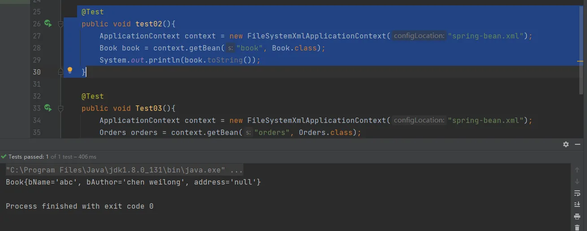
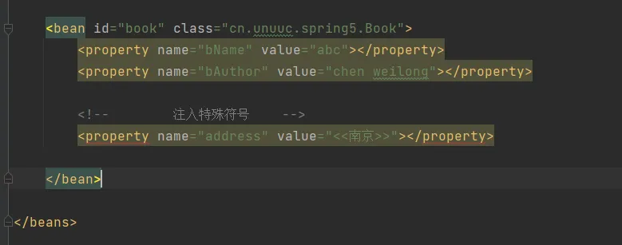
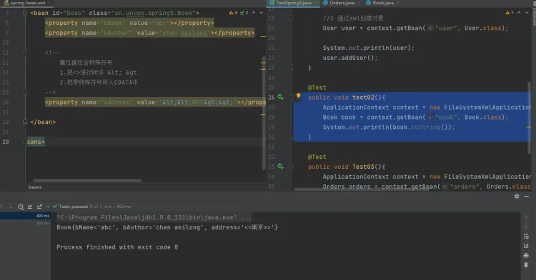
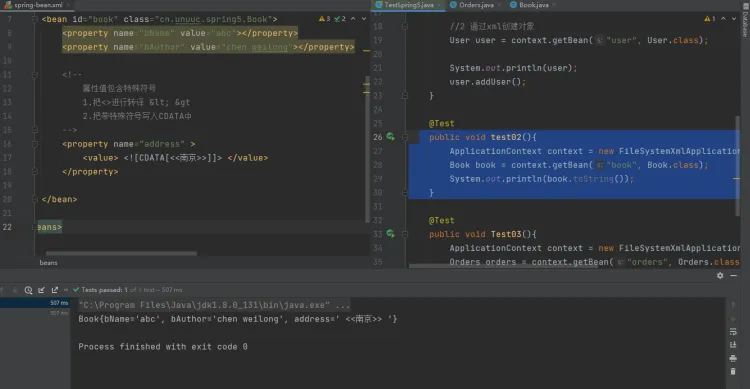

# IOC（xml bean 管理）注入null值和特殊符号
## 字面量
前面文章使用的注入都输入字面量注入，即手动编写属性值。
## null值
使用标签
```xml
<property name="address">
  <null></null>
</property>
```
完整配置文件
```xml
<?xml version="1.0" encoding="UTF-8"?>
<beans xmlns="http://www.springframework.org/schema/beans"
       xmlns:xsi="http://www.w3.org/2001/XMLSchema-instance"
       xmlns:p="http://www.springframework.org/schema/p"
       xsi:schemaLocation="http://www.springframework.org/schema/beans http://www.springframework.org/schema/beans/spring-beans.xsd">

    <bean id="book" class="cn.unuuc.spring5.Book">
        <property name="bName" value="abc"></property>
        <property name="bAuthor" value="chen weilong"></property>
        <!--        注入空值    -->
        <property name="address">
            <null></null>
        </property>
    </bean>

</beans>
```
测试结果



## 属性值包含特殊符号

错误示例：直接写特殊符号，标签直接报错



1. 将特殊符号进行转译，比如 < 等价于 &lt;  > 等价与 &gt;
```xml
<?xml version="1.0" encoding="UTF-8"?>
<beans xmlns="http://www.springframework.org/schema/beans"
       xmlns:xsi="http://www.w3.org/2001/XMLSchema-instance"
       xmlns:p="http://www.springframework.org/schema/p"
       xsi:schemaLocation="http://www.springframework.org/schema/beans http://www.springframework.org/schema/beans/spring-beans.xsd">

    <bean id="book" class="cn.unuuc.spring5.Book">
        <property name="bName" value="abc"></property>
        <property name="bAuthor" value="chen weilong"></property>

        <!--
            属性值包含特殊符号
            1.把<>进行转译 &lt; &gt
            2.把带特殊符号写入CDATA中
        -->
        <property name="address" value="&lt;&lt;南京&gt;&gt;"></property>
       
    </bean>

</beans>
```


2. 把特殊符号写入CDATA中
```xml
<?xml version="1.0" encoding="UTF-8"?>
<beans xmlns="http://www.springframework.org/schema/beans"
       xmlns:xsi="http://www.w3.org/2001/XMLSchema-instance"
       xmlns:p="http://www.springframework.org/schema/p"
       xsi:schemaLocation="http://www.springframework.org/schema/beans http://www.springframework.org/schema/beans/spring-beans.xsd">

    <bean id="book" class="cn.unuuc.spring5.Book">
        <property name="bName" value="abc"></property>
        <property name="bAuthor" value="chen weilong"></property>

        <!--
            属性值包含特殊符号
            1.把<>进行转译 &lt; &gt
            2.把带特殊符号写入CDATA中
        -->
        <property name="address" >
            <value> <![CDATA[<<南京>>]]> </value>
        </property>
       
    </bean>

</beans>
```


