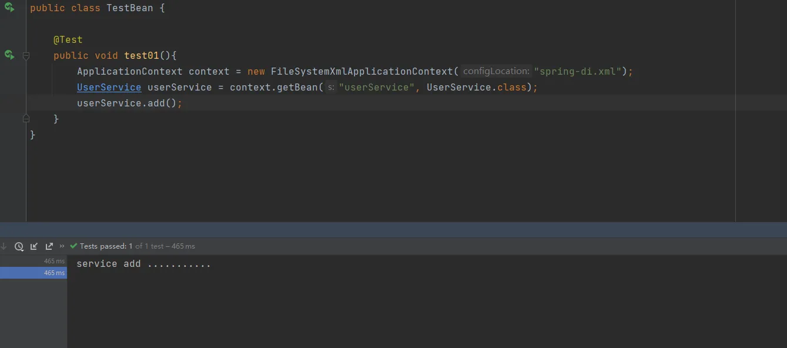
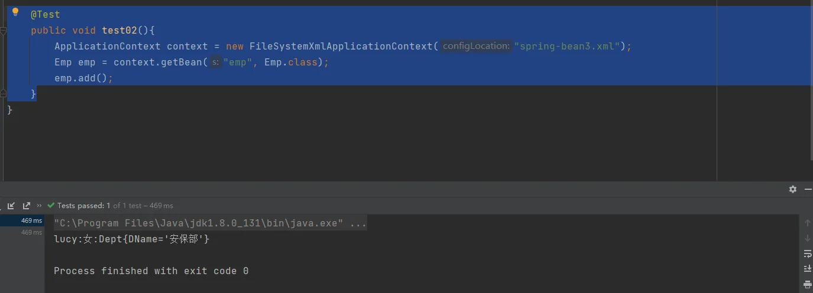
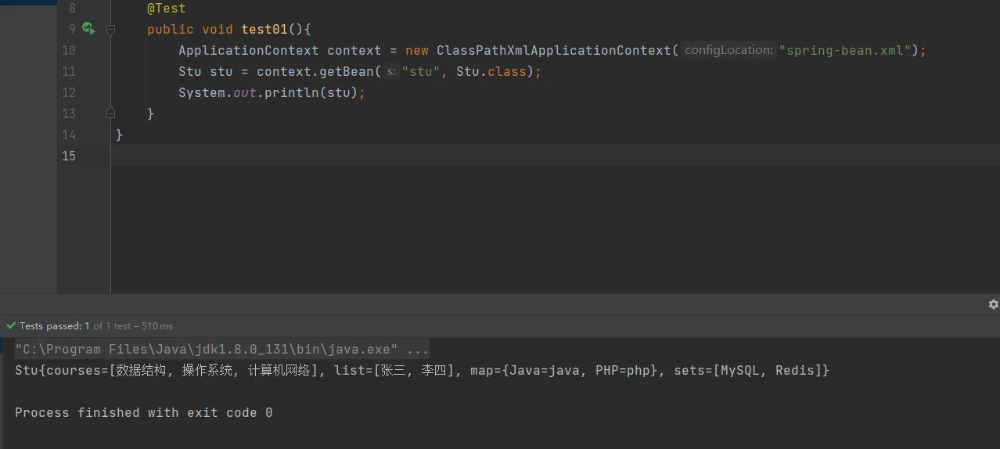
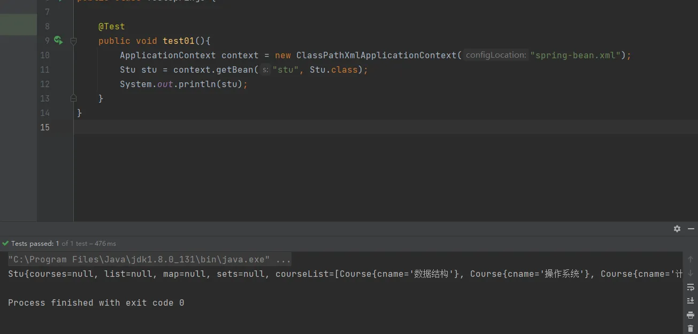
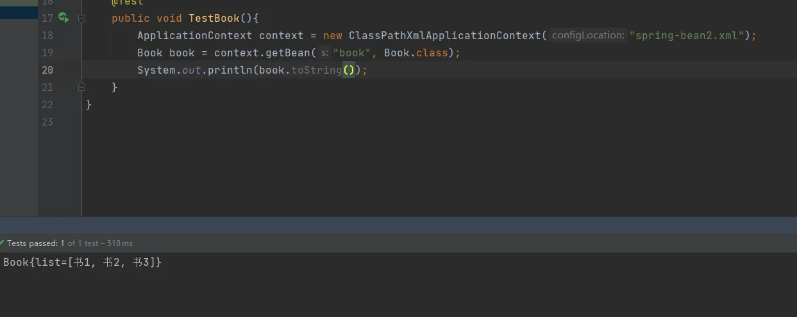

# IOC（xml bean 管理）注入内_外部bean、级联赋值、集合类型

## 注入属性-外部bean
1. 创建两个类service类和dao类
2. 在service调用dao里面的方法

**创建UserService**
```java
public class UserService {
    public void add(){
        System.out.println("service add ...........");
        // 原始方式
        // 创建UserDao对象
        // UserDao userDao = new UserDaoImpl();
        //.update();
    }
}
```
**创建UserDao接口**
```java
public interface UserDao {
    public void update();
}
```
**创建UserDao接口实现类，UserDaoImpl**
```java
public class UserDaoImpl implements UserDao{
    @Override
    public void update() {
        System.out.println("dao update ..........");
    }
}
```
### 使用spring来实现
创建UserDao这个类型的属性，生成set方法，也可以使用有参构造方法
```java
public class UserService {

    private UserDao userDao;

    public void setUserDao(UserDao userDao) {
        this.userDao = userDao;
    }

    public void add(){
        System.out.println("service add ...........");
    }
}
```
配置spring文件
```xml
<?xml version="1.0" encoding="UTF-8"?>
<beans xmlns="http://www.springframework.org/schema/beans"
       xmlns:xsi="http://www.w3.org/2001/XMLSchema-instance"
       xsi:schemaLocation="http://www.springframework.org/schema/beans http://www.springframework.org/schema/beans/spring-beans.xsd">

    <!--    service和dao对象创建     -->
    <bean id="userService" class="cn.unuuc.spring5.service.UserService">
        <!--注入userDao-->
        <!--name:属性名称-->
        <property name="userDao" ref="userDao"></property>
    </bean>
    
    <bean id="userDao" class="cn.unuuc.spring5.dao.UserDaoImpl"></bean>
    
</beans>
```
测试类
```java
@Test
public void test01(){
    ApplicationContext context = new FileSystemXmlApplicationContext("spring-di.xml");
    UserService userService = context.getBean("userService", UserService.class);
    userService.add();
}
```



## 注入属性-内部bean和级联赋值
（1）一对多关系：部门和员工
一个部门有多个员工，一个员工属于一个部门。部门是一，员工是多
（2）在实体类之间表示一对多关系

**（3）在配置文件中进行相关配置**
### 内部bean配置
创建Emp员工类和Dept部门类。
```java
package cn.unuuc.spring5.bean;
/**
 * 员工类
 */
public class Emp {
    private String EName;
    private String gender;

    private Dept dept;

    public void setDept(Dept dept) {
        this.dept = dept;
    }

    public void setEName(String EName) {
        this.EName = EName;
    }

    public void setGender(String gender) {
        this.gender = gender;
    }

    public void add(){
        System.out.println(EName+":"+gender+":"+dept.toString());
    }
}

```
```java
package cn.unuuc.spring5.bean;

import java.util.ArrayList;

/**
 * 部门类
 */
public class Dept {
    private String DName;


    public void setDName(String dName) {
        this.DName = dName;
    }

    @Override
    public String toString() {
        return "Dept{" +
                "DName='" + DName + '\'' +
                '}';
    }
}

```
	编写spring配置文件
```xml
<?xml version="1.0" encoding="UTF-8"?>
<beans xmlns="http://www.springframework.org/schema/beans"
       xmlns:xsi="http://www.w3.org/2001/XMLSchema-instance"
       xsi:schemaLocation="http://www.springframework.org/schema/beans http://www.springframework.org/schema/beans/spring-beans.xsd">

    <!--    内部bean    -->
    <bean id="emp" class="cn.unuuc.spring5.bean.Emp">
        <!--先设置两个普通属性-->
        <property name="EName" value="lucy"></property>
        <property name="gender" value="女"></property>

        <!--设置对象类型属性-->
        <property name="dept">
            <bean id="dept" class="cn.unuuc.spring5.bean.Dept">
                <property name="DName" value="安保部"></property>
            </bean>
        </property>

    </bean>
</beans>
```
	测试类
```java
@Test
public void test02(){
    ApplicationContext context = new FileSystemXmlApplicationContext("spring-bean3.xml");
    Emp emp = context.getBean("emp", Emp.class);
    emp.add();
}
```


### 级联赋值
#### 第一种
```xml
<?xml version="1.0" encoding="UTF-8"?>
<beans xmlns="http://www.springframework.org/schema/beans"
       xmlns:xsi="http://www.w3.org/2001/XMLSchema-instance"
       xsi:schemaLocation="http://www.springframework.org/schema/beans http://www.springframework.org/schema/beans/spring-beans.xsd">

    <!--    内部bean    -->
    <bean id="emp" class="cn.unuuc.spring5.bean.Emp">
        <!--先设置两个普通属性-->
        <property name="EName" value="lucy"></property>
        <property name="gender" value="女"></property>

        <!--级联赋值-->
        <property name="dept" ref="dept"></property>

    </bean>
    <bean id="dept" class="cn.unuuc.spring5.bean.Dept">
        <property name="DName" value="财务部"></property>
    </bean>
</beans>
```
#### 第二种

这种方式需要在Emp类中实现dept的get方法

**这里的原理是：**
a. 创建一个外部bean dept,这个dept bean不需要设置属性（设置了后面也会被覆盖）；
b. 在emp bean内部，先获取外部dept对象，
c. 在通过dept.DName方式对获取到的dept对象进行赋值。
```xml
<?xml version="1.0" encoding="UTF-8"?>
<beans xmlns="http://www.springframework.org/schema/beans"
       xmlns:xsi="http://www.w3.org/2001/XMLSchema-instance"
       xsi:schemaLocation="http://www.springframework.org/schema/beans http://www.springframework.org/schema/beans/spring-beans.xsd">

    
    <bean id="emp" class="cn.unuuc.spring5.bean.Emp">
        <!--先设置两个普通属性-->
        <property name="EName" value="lucy"></property>
        <property name="gender" value="女"></property>

        <!--级联赋值-->
        <property name="dept" ref="dept"></property>
        <property name="dept.DName" value="技术部"></property>

    </bean>
    <bean id="dept" class="cn.unuuc.spring5.bean.Dept">
        <property name="DName" value="财务部"></property>
    </bean>
</beans>
```
## xml注入集合属性
创建一个Stu类，编写不同类型的属性(需要生成set方法)
```java
package cn.unuuc.spring5.collectiontype;

import java.util.Arrays;
import java.util.List;
import java.util.Map;
import java.util.Set;

public class Stu {
    // 1. 数组类型的属性
    private String[] courses;

    // 2. List集合类型属性
    private List<String> list;

    // 3. Map类型属性
    private Map<String,String> map;

    // 4. Set类型属性
    private Set<String> sets;

    public void setSets(Set<String> sets) {
        this.sets = sets;
    }

    public void setList(List<String> list) {
        this.list = list;
    }

    public void setMap(Map<String, String> map) {
        this.map = map;
    }

    public void setCourses(String[] courses) {
        this.courses = courses;
    }

    @Override
    public String toString() {
        return "Stu{" +
                "courses=" + Arrays.toString(courses) +
                ", list=" + list +
                ", map=" + map +
                ", sets=" + sets +
                '}';
    }
}

```
### 编写配置文件
```xml
<?xml version="1.0" encoding="UTF-8"?>
<beans xmlns="http://www.springframework.org/schema/beans"
       xmlns:xsi="http://www.w3.org/2001/XMLSchema-instance"
       xsi:schemaLocation="http://www.springframework.org/schema/beans http://www.springframework.org/schema/beans/spring-beans.xsd">

    <!--    集合类型的属性注入    -->
    <!--    创建对象    -->
    <bean id="stu" class="cn.unuuc.spring5.collectiontype.Stu">

        <!--    数组类型属性注入   -->
        <property name="courses">
            <!--    list 标签 和 array 标签都可以    -->
            <array>
                <value>数据结构</value>
                <value>操作系统</value>
                <value>计算机网络</value>
            </array>
        </property>

        <!--    List类型属性注入   -->
        <property name="list">
            <list>
                <value>张三</value>
                <value>李四</value>
            </list>
        </property>

        <!--    Map类型属性注入   -->
        <property name="map">
            <map>
                <entry key="Java" value="java"></entry>
                <entry key="PHP" value="php"></entry>
            </map>
        </property>

        <!--    Set类型属性注入   -->
        <property name="sets">
            <set>
                <value>MySQL</value>
                <value>Redis</value>
            </set>
        </property>
    </bean>

</beans>
```
### 测试结果



## xml注入集合属性补充
### 在集合里面设置对象类型值
#### 创建Course类，表示课程学生所学的多门课程类
```java
package cn.unuuc.spring5.collectiontype;

public class Course {
    private String cname;// 课程名称

    public void setCname(String cname) {
        this.cname = cname;
    }

    @Override
    public String toString() {
        return "Course{" +
                "cname='" + cname + '\'' +
                '}';
    }
}

```
在Stu类种添加属性并添加set方法
```java
    // 5. 学生所学多门课程
    private List<Course> courseList;
    
    public void setCourseList(List<Course> courseList) {
        this.courseList = courseList;
    }
```
#### 配置文件
```java
<?xml version="1.0" encoding="UTF-8"?>
<beans xmlns="http://www.springframework.org/schema/beans"
       xmlns:xsi="http://www.w3.org/2001/XMLSchema-instance"
       xsi:schemaLocation="http://www.springframework.org/schema/beans http://www.springframework.org/schema/beans/spring-beans.xsd">

    <!--    集合类型的属性注入    -->
    <!--    创建对象    -->
    <bean id="stu" class="cn.unuuc.spring5.collectiontype.Stu">

        <!--    List集合类型，值是对象   -->
        <property name="courseList">
            <list>
                <ref bean="course1"></ref>
                <ref bean="course2"></ref>
                <ref bean="course3"></ref>
            </list>
        </property>

    </bean>

    <!--创建多个Course对象-->
    <bean id="course1" class="cn.unuuc.spring5.collectiontype.Course">
        <property name="cname" value="数据结构"></property>
    </bean>
    <bean id="course2" class="cn.unuuc.spring5.collectiontype.Course">
        <property name="cname" value="操作系统"></property>
    </bean>
    <bean id="course3" class="cn.unuuc.spring5.collectiontype.Course">
        <property name="cname" value="计算机网络"></property>
    </bean>
    
</beans>
```
#### 测试



### 把集合注入的部门提取出来
创建一个Book类用来测试
```java
package cn.unuuc.spring5.collectiontype;

import java.util.List;

public class Book {
    private List<String> list;

    @Override
    public String toString() {
        return "Book{" +
                "list=" + list +
                '}';
    }

    public void setList(List<String> list) {
        this.list = list;
    }
}

```
#### 在spring的配置文件种引入一个命名空间 util
```xml
<?xml version="1.0" encoding="UTF-8"?>
<beans xmlns="http://www.springframework.org/schema/beans"
       xmlns:xsi="http://www.w3.org/2001/XMLSchema-instance"
       xmlns:util="http://www.springframework.org/schema/util"
       xsi:schemaLocation="http://www.springframework.org/schema/beans http://www.springframework.org/schema/beans/spring-beans.xsd
                           http://www.springframework.org/schema/util http://www.springframework.org/schema/util/spring-util.xsd">


</beans>
```
#### 使用util标签完成list集合注入的提取
```java
<?xml version="1.0" encoding="UTF-8"?>
<beans xmlns="http://www.springframework.org/schema/beans"
       xmlns:xsi="http://www.w3.org/2001/XMLSchema-instance"
       xmlns:util="http://www.springframework.org/schema/util"
       xsi:schemaLocation="http://www.springframework.org/schema/beans http://www.springframework.org/schema/beans/spring-beans.xsd
                           http://www.springframework.org/schema/util http://www.springframework.org/schema/util/spring-util.xsd">

    <!--      提取list集合类型属性注入      -->
    <util:list id="bookList">
        <!--如果是对象则用ref标签-->
        <value>书1</value>
        <value>书2</value>
        <value>书3</value>
    </util:list>

</beans>
```
#### 使用提取出来的
```xml
<?xml version="1.0" encoding="UTF-8"?>
<beans xmlns="http://www.springframework.org/schema/beans"
       xmlns:xsi="http://www.w3.org/2001/XMLSchema-instance"
       xmlns:util="http://www.springframework.org/schema/util"
       xsi:schemaLocation="http://www.springframework.org/schema/beans http://www.springframework.org/schema/beans/spring-beans.xsd
                           http://www.springframework.org/schema/util http://www.springframework.org/schema/util/spring-util.xsd">

    <!--      提取list集合类型属性注入      -->
    <util:list id="bookList">
        <!--如果是对象则用ref标签-->
        <value>书1</value>
        <value>书2</value>
        <value>书3</value>
    </util:list>

    <!--      使用提取的list集合类型属性注入    -->
    <bean id="book" class="cn.unuuc.spring5.collectiontype.Book">
        <property name="list" ref="bookList"></property>
    </bean>

</beans>
```

