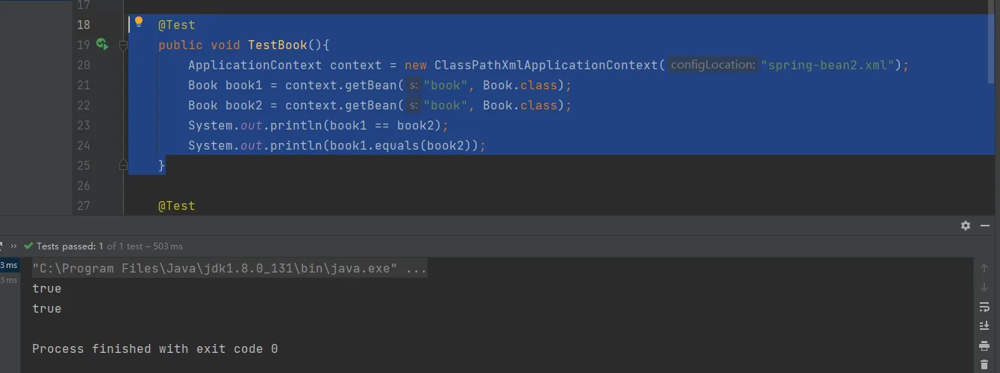
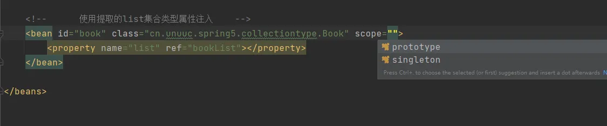
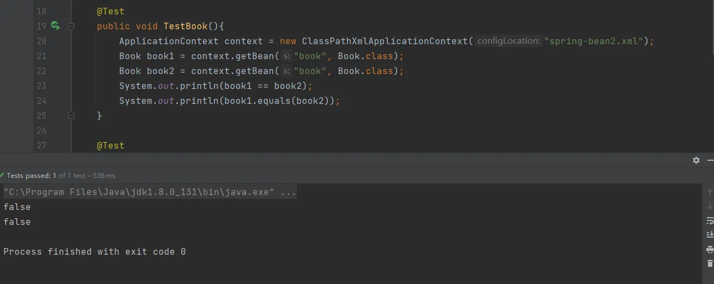
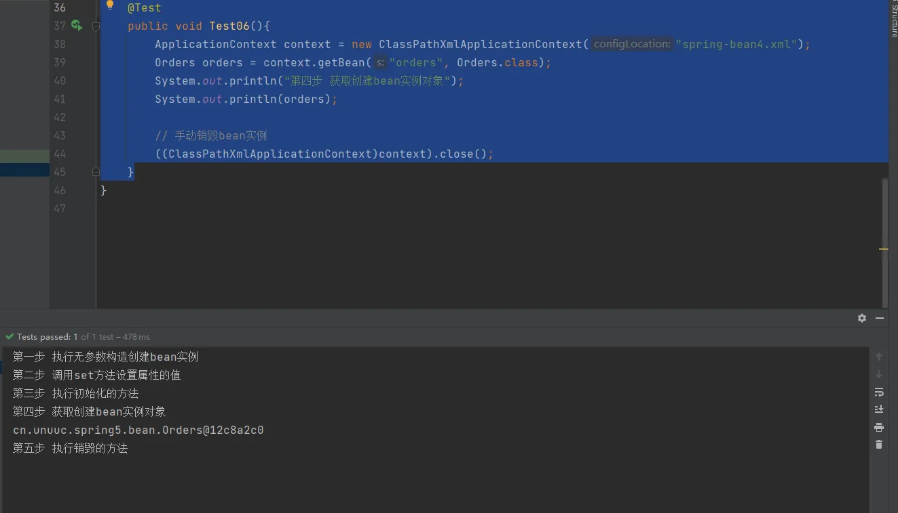
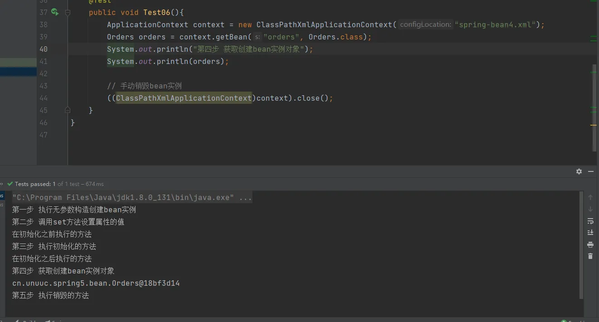

# IOC（xml bean 管理）bean的作用域、生命周期

## Bean的作用域
1. 在Spring中，可以设置创建bean实力时单实例还是多实例。
2. 在Spring中，默认的情况下，bean是单实例对象。
### 默认情况下为单实例



### 设置bean为多实例

1. 在Spring配置文件bean标签里面有属性用于设置单实例还是多实例。
2. scope属性值：它有多个属性，但常用的只有两个
   1. 默认值：singleton,表示单实例
   2. prototype：表示多实例对象



将scope属性设置为  prototype  在执行测试方法，验证是否为不同对象



equals：为Object类中的方法，内部使用 `==` 来判断，对于子类来说，如果没有重写equals，那么该方法等用于直接使用 `==`

1. 设置scope值是singleton时候，加载配置文件时就会创建单实例对象；
2. 设置scope值为prototype 时，不是在加载配置文件时创建对象，而是在调用getBean()时候创建多实例对象。
3. scope另外两种属性值
   1. request
   2. session
## Bean的生命周期
从对象的创建到对象销毁的过程称为生命周期。

### bean的创建过程

1. 通过构造器创建bean实例（无参构造）
2. 为bean的属性设置值和对其它bean的一个引用（调用set方法）
3. 调用bean的初始化方法（需要进行配置初始化的方法）
4. bean就可以使用了（对象获取到了）
5. 当容器关闭时候，调用bean的销毁方法（需要进行配置销毁的方法）

### 代码实现演示生命周期

1. 创建Order类
```java
package cn.unuuc.spring5.bean;

public class Orders {
    private String oname;

    public Orders() {
        System.out.println("第一步 执行无参数构造创建bean实例");
    }

    public void setOname(String oname) {
        System.out.println("第二步 调用set方法设置属性的值");
        this.oname = oname;
    }

    // 创建执行的初始化方法,需要在配置文件中配置
    public void initMethod(){
        System.out.println("第三步 执行初始化的方法");
    }

    // 创建执行的销毁方法
    public void DestroyMethod(){
        System.out.println("第五步 执行销毁的方法");
    }
}
```

2. 配置spring配置文件
```xml
<?xml version="1.0" encoding="UTF-8"?>
<beans xmlns="http://www.springframework.org/schema/beans"
       xmlns:xsi="http://www.w3.org/2001/XMLSchema-instance"
       xsi:schemaLocation="http://www.springframework.org/schema/beans http://www.springframework.org/schema/beans/spring-beans.xsd">

    <bean id="orders" class="cn.unuuc.spring5.bean.Orders" init-method="initMethod" destroy-method="DestroyMethod">
        <property name="oname" value="手机"></property>
    </bean>
</beans>
```

3. 测试方法
```java
    @Test
    public void Test06(){
        ApplicationContext context = new ClassPathXmlApplicationContext("spring-bean4.xml");
        Orders orders = context.getBean("orders", Orders.class);
        System.out.println("第四步 获取创建bean实例对象");
        System.out.println(orders);

        // 手动销毁bean实例
        ((ClassPathXmlApplicationContext)context).close();
    }
```



### bean的后置处理器，bean的生命周期一共七步

1. 通过构造器创建bean实例（无参构造）
2. 为bean的属性设置值或对其它bean的一个引用（调用set方法）
   1. 把bean实例传递bean后置处理器方法
   2. `postProcessBeforeInitialization`
3. 调用bean的初始化方法（需要进行配置初始化的方法）
   1. 把bean实例传递bean后置处理器方法
   2. `postProcessAfterInitialization`
4. bean就可以使用了（对象获取到了）
5. 当容器关闭时候，调用bean的销毁方法（需要进行配置销毁的方法）
### 演示添加后置处理器效果

1. 创建类，实现接口 BeanPostProcessor，创建后置处理器
```java
package cn.unuuc.spring5.bean;

import org.springframework.beans.BeansException;
import org.springframework.beans.factory.config.BeanPostProcessor;

public class MyBeanPost implements BeanPostProcessor {

    @Override
    public Object postProcessBeforeInitialization(Object bean, String beanName) throws BeansException {
        System.out.println("在初始化之前执行的方法");
        return bean;
    }

    @Override
    public Object postProcessAfterInitialization(Object bean, String beanName) throws BeansException {
        System.out.println("在初始化之后执行的方法");
        return bean;
    }
}
```

2. 配置文件
```xml
<?xml version="1.0" encoding="UTF-8"?>
<beans xmlns="http://www.springframework.org/schema/beans"
       xmlns:xsi="http://www.w3.org/2001/XMLSchema-instance"
       xsi:schemaLocation="http://www.springframework.org/schema/beans http://www.springframework.org/schema/beans/spring-beans.xsd">

    <bean id="orders" class="cn.unuuc.spring5.bean.Orders" init-method="initMethod" destroy-method="DestroyMethod">
        <property name="oname" value="手机"></property>
    </bean>

    <!--    配置后置处理器(就是创建对象，因为这个对象实现了BeanPostProcessor接口，所有spring会认为这个类就是后置处理器类)    -->
    <bean id="myBeanPost" class="cn.unuuc.spring5.bean.MyBeanPost"></bean>
</beans>
```
后置处理器在所有bean初始化时都会执行。


