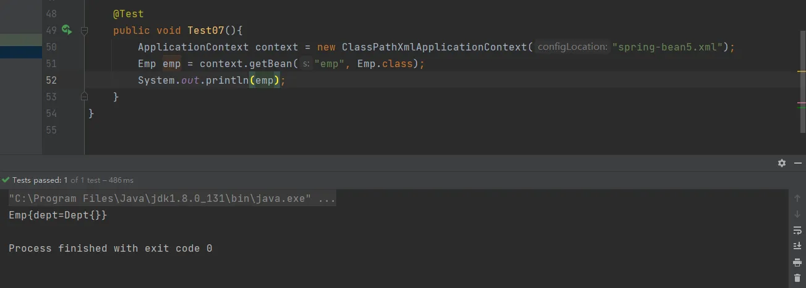

# IOC（xml bean 管理）自动装配

## 什么是自动装配
根据指定装配规则（属性名称或属性类型），Spring自动将匹配的属性值进行注入。
## 定义两个测试类
```java
package cn.unuuc.spring5.autowire;

public class Dept {
    @Override
    public String toString() {
        return "Dept{}";
    }
}

```
```java
package cn.unuuc.spring5.autowire;

public class Emp {
    private Dept dept;

    @Override
    public String toString() {
        return "Emp{" +
                "dept=" + dept +
                '}';
    }

    public void setDept(Dept dept) {
        this.dept = dept;
    }

    public  void test(){
        System.out.println(dept);
    }
}

```
## 手动装配
**以上面两个类为例，进行手动装配的实例，配置spring配置文件。**
```xml
<?xml version="1.0" encoding="UTF-8"?>
<beans xmlns="http://www.springframework.org/schema/beans"
       xmlns:xsi="http://www.w3.org/2001/XMLSchema-instance"
       xsi:schemaLocation="http://www.springframework.org/schema/beans http://www.springframework.org/schema/beans/spring-beans.xsd">

    <bean id="emp" class="cn.unuuc.spring5.autowire.Emp">
        <property name="dept" ref="dept"></property>
    </bean>

    <bean id="dept" class="cn.unuuc.spring5.autowire.Dept"></bean>

</beans>
```
**测试结果**



## 自动装配
```xml
<?xml version="1.0" encoding="UTF-8"?>
<beans xmlns="http://www.springframework.org/schema/beans"
       xmlns:xsi="http://www.w3.org/2001/XMLSchema-instance"
       xsi:schemaLocation="http://www.springframework.org/schema/beans http://www.springframework.org/schema/beans/spring-beans.xsd">
<!--
    bean标签属性autowire,配置自动装配
    byName:根据属性名称注入,注入属性bean id的名字要和属性名字一样
    byType:根据属性类型注入,相同类型的bean不能定义多个
-->
    <bean id="emp" class="cn.unuuc.spring5.autowire.Emp" autowire="byType">
    </bean>

    <bean id="dept" class="cn.unuuc.spring5.autowire.Dept"></bean>

</beans>
```
**	在实际过程中，一般都用注解来实现自动装配。**
