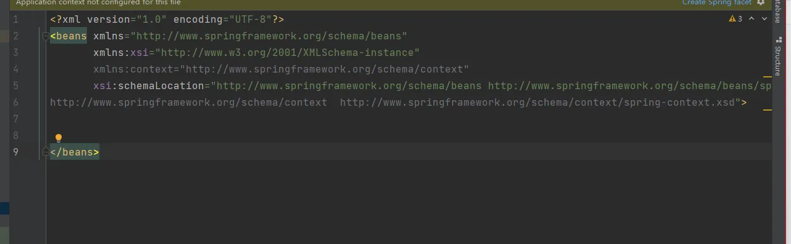

# IOC（xml bean 管理）外部属性文件

以配置Druid数据库连接池为例，演示xml引入外部属性文件

1.  导入druid.jar包
2. 创建jdbc.properties文件
```xml
prop.driverClass=com.mysql.jdbc.Driver
prop.url=jdbc://mysql://localhost:3306/userDB
prop.userName=root
prop.password=root
```

3. 将jdbc.properties文件引入到spring配置文件中

需要添加命名空间
```xml
xmlns:context="http://www.springframework.org/schema/context"
```
```xml
http://www.springframework.org/schema/context  http://www.springframework.org/schema/context/spring-context.xsd
```


4. 在spring配置文件中使用标签引入外部配置文件
```xml
<?xml version="1.0" encoding="UTF-8"?>
<beans xmlns="http://www.springframework.org/schema/beans"
       xmlns:xsi="http://www.w3.org/2001/XMLSchema-instance"
       xmlns:context="http://www.springframework.org/schema/context"
       xsi:schemaLocation="http://www.springframework.org/schema/beans http://www.springframework.org/schema/beans/spring-beans.xsd
http://www.springframework.org/schema/context  http://www.springframework.org/schema/context/spring-context.xsd">

    <!--引入外部的属性文件-->
    <context:property-placeholder location="classpath:jdbc.properties"></context:property-placeholder>

</beans>
```

5. 配置连接池
```xml
<?xml version="1.0" encoding="UTF-8"?>
<beans xmlns="http://www.springframework.org/schema/beans"
       xmlns:xsi="http://www.w3.org/2001/XMLSchema-instance"
       xmlns:context="http://www.springframework.org/schema/context"
       xsi:schemaLocation="http://www.springframework.org/schema/beans http://www.springframework.org/schema/beans/spring-beans.xsd
http://www.springframework.org/schema/context  http://www.springframework.org/schema/context/spring-context.xsd">

    <!--引入外部的属性文件-->
    <context:property-placeholder location="classpath:jdbc.properties"></context:property-placeholder>

    <bean id="dataSource" class="com.alibaba.druid.pool.DruidDataSource">
        <property name="driverClassName" value="${prop.driverClass}"></property>
        <property name="url" value="${prop.url}"></property>
        <property name="username" value="${prop.userName}"></property>
        <property name="password" value="${prop.password}"></property>
    </bean>
</beans>
```


