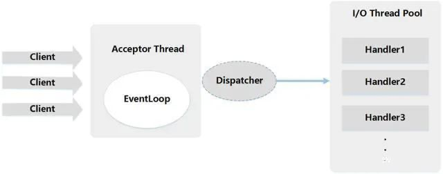
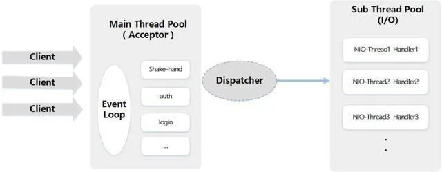

# Netty 高频题

## 介绍一些Netty 

&emsp;Netty 是一个基于 Java 的异步事件驱动的网络应用框架，用于快速开发可维护的高性能协议服务器和客户端。它抽象了 Java NIO（New I/O）的复杂性，并提供了更简单和灵活的 API。以下是 Netty 的一些主要特性和优势：

**主要特性:**

1. **高性能**：Netty 充分利用了 Java NIO 提供的非阻塞 I/O 操作，使其可以处理大量并发连接和数据传输需求。
2. **异步和事件驱动**：Netty 使用事件驱动的编程模型，允许异步处理网络事件，减少阻塞等待，提高系统吞吐量和响应速度。
3. **灵活性和可扩展性**：Netty 提供了丰富的扩展点，可以方便地进行自定义协议、编解码器、处理器等组件的开发和集成。
4. **丰富的协议支持**：Netty 内置了多种协议支持，如 HTTP、WebSocket、SSL/TLS 等，并且可以方便地扩展支持其他自定义协议。
5. **可靠性和稳定性**：Netty 经过了广泛的测试和优化，具有高可靠性和稳定性，已经在众多大型项目中得到验证。

## Netty 的核心组件

1. **Channel**：Netty 中的基础通信抽象，表示一个连接，可以进行读写操作。
2. **EventLoop**：负责处理 I/O 操作的事件循环，Netty 的核心机制，用于调度和执行事件。
3. **ChannelHandler**：用于处理 I/O 事件的处理器，可以对事件进行拦截、转换和处理。
4. **Pipeline**：每个 Channel 都有一个 Pipeline，用于组织和管理多个 ChannelHandler。
5. **Bootstrap**：Netty 的启动类，用于配置和启动客户端或服务器。

## Netty 的高性能主要体现在哪方面

1. 基于异步事件驱动和非阻塞IO，提高并发和吞吐量；
2. 内存池设计：使用直接内存，并且可重复利用；
3. 串行化处理读写：避免使用锁带来的额外开销；
4. 零拷贝：尽量做到不必要的内存拷贝：

## Netty 线程模型

&emsp;Netty 通过 Reactor 模型基于多路复用器接收并处理用户请求，内部实现了两个线程池，boss 线程池和 work 线程池，其中 boss 线程池的线程负责处理请求的 accept 事件，当接收到 accept 事件的请求时，把对应的 socket 封装到一个 NioSocketChannel 中，并交给 work 线程池，其中 work 线程池负责请求的 read 和 write 事件，由对应的 Handler 处理。

**单线程模型**

&emsp;所有 IO 操作都由一个线程完成，即多路复用、事件分发和处理都是在一个 Reactor 线程上完成的。既要接收客户端的连接请求，向服务端发起连接，又要发送、读取请求或应答、响应消息。一个 NIO 线程同时处理成百上千的链路，性能上无法支撑，速度慢，若线程进入死循环，整个程序不可用，对于高负载、高并发的应用场景不合适。

```java
//1.eventGroup既用于处理客户端连接，又负责具体的处理。 
EventLoopGroup eventGroup = new NioEventLoopGroup(1); 
//2.创建服务端启动引导/辅助类：
ServerBootstrap ServerBootstrap b = new ServerBootstrap(); 
boobtstrap.group(eventGroup, eventGroup) 
```

**多线程模型**

&emsp;有一个 NIO 线程（Acceptor） 只负责监听服务端，接收客户端的 TCP 连接请求；NIO 线程池负责网络 IO 的操作，即消息的读取、解码、编码和发送；1 个 NIO 线程可以同时处理 N 条链路，但是 1 个链路只对应 1 个 NIO 线程，这是为了防止发生并发操作问题。但在并发百万客户端连接或需要安全认证时，一个 Acceptor 线程可能会存在性能不足问题。



```java
// 1.bossGroup 用于接收连接，workerGroup 用于具体的处理
EventLoopGroup bossGroup = new NioEventLoopGroup(1);
EventLoopGroup workerGroup = new NioEventLoopGroup();
try { 
    //2.创建服务端启动引导/辅助类：
    ServerBootstrap ServerBootstrap b = new ServerBootstrap(); 
    //3.给引导类配置两大线程组,确定了线程模型 
    b.group(bossGroup, workerGroup) 
    //......
}
```

**主从多线程模型**

&emsp;Acceptor 线程用于绑定监听端口，接收客户端连接，将 SocketChannel 从主线程池的 Reactor 线程的多路复用器上移除，重新注册到 Sub 线程池的线程上，用于处理 IO 的读写等操作，从而保证主 Reactor 只负责接入认证、握手等操作。如果多线程模型无法满足你的需求的时候，可以考虑使用主从多线程模型 。



```java
// 1.bossGroup 用于接收连接，workerGroup 用于具体的处理
EventLoopGroup bossGroup = new NioEventLoopGroup();
EventLoopGroup workerGroup = new NioEventLoopGroup();
try { 
    //2.创建服务端启动引导/辅助类：
    ServerBootstrap ServerBootstrap b = new ServerBootstrap(); 
    //3.给引导类配置两大线程组,确定了线程模型 
    b.group(bossGroup, workerGroup) 
    //......
}
```

## Netty 启动过程

```java
// 1.bossGroup 用于接收连接，workerGroup 用于具体的处理 
EventLoopGroup bossGroup = new NioEventLoopGroup(1); 
EventLoopGroup workerGroup = new NioEventLoopGroup(); 
try { 
    //2.创建服务端启动引导/辅助类：ServerBootstrap 
    ServerBootstrap b = new ServerBootstrap(); 
    //3.给引导类配置两大线程组,确定了线程模型 
    b.group(bossGroup, workerGroup) // (非必备)打印日志 
    .handler(new LoggingHandler(LogLevel.INFO)) // 4.指定 IO 模型 
    .channel(NioServerSocketChannel.class) 
    .childHandler(new ChannelInitializer<SocketChannel>() {
         @Override 
         public void initChannel(SocketChannel ch) {
             ChannelPipeline p = ch.pipeline(); 
             //5.可以自定义客户端消息的业务处理逻辑 
             p.addLast(new HelloServerHandler()); 
        } 
    }); 
    // 6.绑定端口,调用 sync 方法阻塞直到绑定完成 
    ChannelFuture f = b.bind(port).sync();
    // 7.阻塞等待直到服务器Channel关闭(closeFuture()方法获取Channel 的CloseFuture对象,然后调用sync()方法) 
    f.channel().closeFuture().sync(); 
} finally { 
    //8.优雅关闭相关线程组资源 
    bossGroup.shutdownGracefully(); 
    workerGroup.shutdownGracefully(); 
}
```

## 什么是拆包、黏包

&emsp;TCP 是一个面向流的传输协议，所谓流，就是没有界限的一串数据。TCP 底层并不了解上层业务数据的具体含义，它会根据 TCP 缓冲区的实际情况进行包的划分，所以在业务上认为，一个完整的包可能会被 TCP 拆分成多个包进行发送，也有可能把多个小的包封装成一个大的数据包发送，这就是所谓的 TCP 粘包和拆包问题。

&emsp;粘包和拆包是 TCP 网络编程中不可避免的，无论是服务端还是客户端，当我们读取或者发送消息的时候，都需要考虑 TCP 底层的粘包/拆包机制。


&emsp;数据从发送方到接收方需要经过操作系统的缓冲区，而造成粘包和拆包的主要原因就在这个缓冲区上。粘包可以理解为**缓冲区数据堆积**，导致多个请求数据粘在一起，而拆包可以理解为发送的数据大于缓冲区，进行拆分处理。

## Netty 如何解决拆包、黏包的问题

**拆包**

* 拆包问题比较简单，用户可以自己定义自己的编码器进行处理

**黏包**

* 固定长度的拆包器（FixedLengthFrameDecoder），每个应用层数据包的都拆分成都是固定长度的大小；

* 行拆包器（LineBasedFrameDecoder），每个应用层数据包都以换行符作为分隔符，进行分割拆分；

* 分隔符拆包器(DelimiterBasedFrameDecoder），每个应用层数据包，都通过自定义的分隔符，进行分割拆分；

* 基于数据包长度的拆包器（LengthFieldBasedFrameDecoder），将应用层数据包的长度，作为接收端应用层数据包的拆分依据。按照应用层数据包的大小，拆包。这个拆包器，有一个要求，就是应用层协议中包含数据包的长度。

