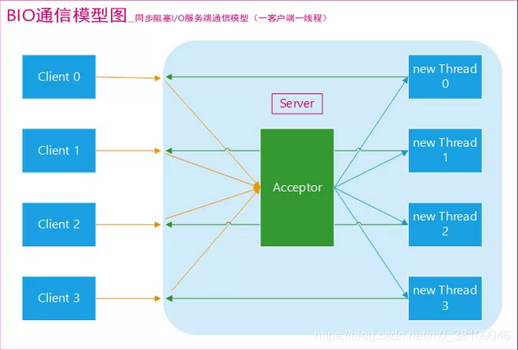
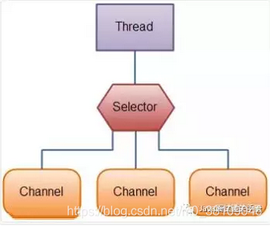
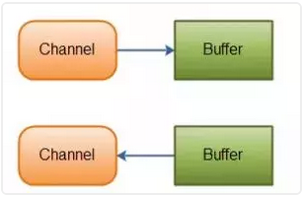

# IO 线程模型

&emsp; 在介绍IO模型前需要明确两个概念 **同步和异步**、**阻塞与非阻塞**。

## 同步与异步
* **同步：** 同步就是发起一个调用后，被调用者未处理完请求之前，调用不返回。特点是调用者需要等待操作期间无法执行其它任务。
* **异步：** 异步就是发起一个调用后，立刻得到被调用者的回应表示已接收到请求，但是被调用者并没有返回结果，此时我们可以处理其他的请求，被调用者通常依靠事件，回调等机制来通知调用者其返回结果。特点是调用者可以继续执行其它任务，无需等待。

&emsp;同步和异步的区别最大在于异步的话调用者不需要等待处理结果，被调用者会通过回调等机制来通知调用者其返回结果。

## 阻塞与非阻塞

&emsp; 阻塞与非阻塞主要描述的事 **IO操作** 对 **线程** 的影响。这一步是由操作系统来完成，主要是对**用户态**与**系统态**之间的数据转换操作。

* **阻塞**： I/O 操作未完成时，线程会被挂起，直到操作完成后才继续执行。

* **非阻塞**： I/O 操作未完成时，线程不会被挂起，可以继续执行其他任务。线程需要不断检查（polling）操作的状态或通过事件通知机制获知操作完成。

## 同步阻塞IO（ BIO ）

&emsp;服务器实现模式为一个连接一个线程，即客户端有连接请求时服务器端就需要启动一个线程进行处理，如果这个连接不做任何事情会造成不必要的线程开销，当然可以通过线程池机制改善。BIO 方式适用于连接数目比较小且固定的架构，这种方式对服务器资源要求比较高，并发局限于应用中，JDK 1.4 以前的唯一选择，但程序直观简单易理解。

&emsp;同步阻塞I/O模式，数据的读取写入必须阻塞在一个线程内等待其完成。

&emsp;图中Acceptor 线程负责监听客户端连接，一般通过where循环中调用accept()方法监听连接，当接受到请求时会new一个单独的线程做处理。

## 同步非阻塞 IO（NIO）

&emsp;服务器实现模式为一个请求一个线程，即客户端发送的连接请求都会注册到多路复用器上，多路复用器轮询到连接有 IO 请求时才启动一个线程进行处理。NIO 方式适用于连接数目多且连接比较短（轻操作）的架构，比如聊天服务器，并发局限于应用中，编程比较复杂，JDK 1.4 开始支持。

&emsp;NIO 是面向缓冲区的，Buffer 可读可写。

**NIO核心组件**

* Channel(通道)
* Buffer(缓冲区)
* Selector(选择器)

## 异步非阻塞 IO（AIO）

&emsp;服务器实现模式为一个有效请求一个线程，客户端的 IO 请求都是由 OS 先完成了再通知服务器应用去启动线程进行处理。AIO 方式使用于连接数目多且连接比较长（重操作）的架构，比如相册服务器，充分调用 OS 参与并发操作，编程比较复杂，JDK 1.7 开始支持。

&emsp;AIO 也就是 NIO 2。在 Java 7 中引入了 NIO 的改进版 NIO 2,它是异步非阻塞的IO模型。异步 IO 是基于事件和回调机制实现的，也就是应用操作之后会直接返回，不会堵塞在那里，当后台处理完成，操作系统会通知相应的线程进行后续的操作。

Java中提供的IO有关的API，在文件处理的时候，其实依赖操作系统层面的IO操作实现的。比如在Linux 2.6以后，Java中NIO和AIO都是通过epoll来实现的，而在Windows上，AIO是通过IOCP来实现的。