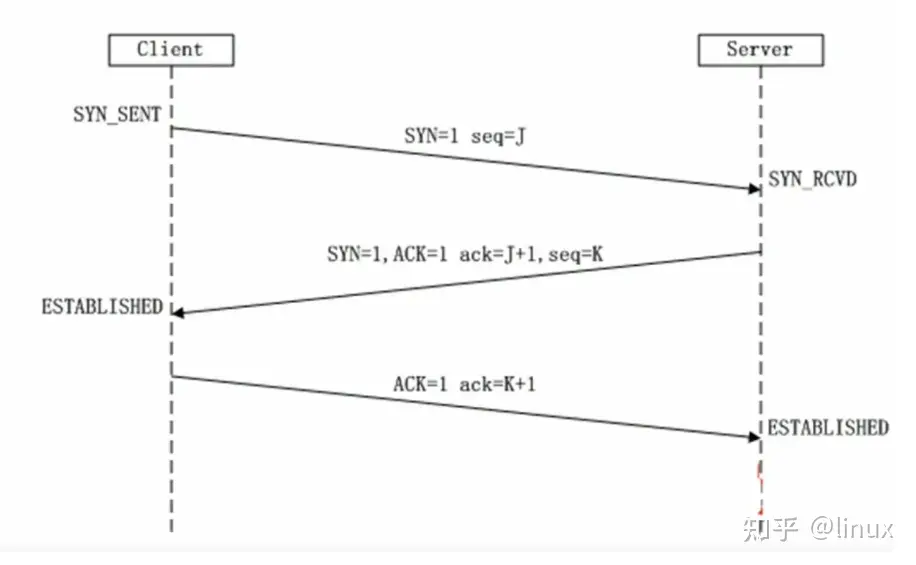

# TCP 协议

## TCP 与 UDP 的区别

* TCP是面向连接的协议，发送数据前要先建立连接，TCP提供可靠的服务，也就是说，通过TCP连接传输的数据不会丢失，没有重复，并且按顺序到达；
* UDP是无连接的协议，发送数据前不需要建立连接，是没有可靠性；
* TCP通信类似于于要打个电话，接通了，确认身份后，才开始进行通行；
* UDP通信类似于学校广播，靠着广播播报直接进行通信。
* TCP只支持点对点通信，UDP支持一对一、一对多、多对一、多对多；
* TCP是面向字节流的，UDP是面向报文的； 面向字节流是指发送数据时以字节为单位，一个数据包可以拆分成若干组进行发送，而UDP一个报文只能一次发完。
* TCP首部开销（20字节）比UDP首部开销（8字节）要大
* UDP 的主机不需要维持复杂的连接状态表

## TCP 三次握手

&emsp;在网络数据传输中，传输层协议TCP是要建立连接的可靠传输，TCP建立连接的过程，我们称为三次握手。

* 第一次握手：Client将SYN置1，随机产生一个初始序列号seq发送给Server，进入SYN_SENT状态；
* 第二次握手：Server收到Client的SYN=1之后，知道客户端请求建立连接，将自己的SYN置1，ACK置1，产生一个acknowledge number=sequence number+1，并随机产生一个自己的初始序列号，发送给客户端；进入SYN_RCVD状态；
* 第三次握手：客户端检查acknowledge number是否为序列号+1，ACK是否为1，检查正确之后将自己的ACK置为1，产生一个acknowledge number=服务器发的序列号+1，发送给服务器；进入ESTABLISHED状态；服务器检查ACK为1和acknowledge number为序列号+1之后，也进入ESTABLISHED状态；完成三次握手，连接建立。

**简单说**

* 客户端向服务端发送SYN
* 服务端返回SYN,ACK
* 客户端发送ACK