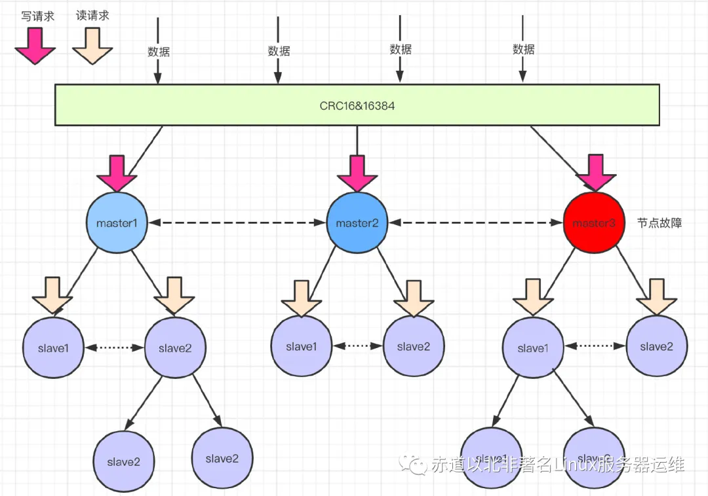

# Redis 主从、哨兵、集群
[原文地址](https://mp.weixin.qq.com/s?__biz=MzI3ODU4MTQ3Mw==&mid=2247497624&idx=5&sn=851bab4373279f7a0922755c0c83896b&chksm=eb566e16dc21e700012ae99641db3652d0ce82e5eefe915d950544a9ad5ff081e730d4b2b7d5&scene=27)

&emsp;&emsp;Redis作为一种高性能的内存数据库，普遍用于目前主流的分布式架构系统中。为了提高系统的容错率，使用多实例的Redis也是必不可免的，
但同样复杂度也相比单实例高很多。本文主要会介绍Redis在多机数据库下的几种实现以及优缺点。

## 单机模式

&emsp;&emsp;单机模式就是安装一个redis，启动起来，业务调用即可。具体安装步骤和启动步骤就不赘述了，单机在很多场景也是有使用的，例如在一个并非必须保证高可用的情况下。

**单机的优点:**

* 部署简单，0成本。
* 成本低，没有备用节点，不需要其他的开支。
* 高性能，单机不需要同步数据，数据天然一致性。

**单机的缺点：**

* 可靠性保证不是很好，单节点有宕机的风险。
* 单机高性能受限于CPU的处理能力，redis是单线程的。
* 单机模式选择需要根据自己的业务场景去选择，如果需要很高的性能、可靠性，单机就不太合适了。

## Redis的主从模式

&emsp;&emsp;主从模式就是N个redis实例，可以是1主N从，也可以N主N从（N主N从则不是严格意义上的主从模式了，后续的集群模式会说到，N主N从就是N+N个redis实例。）主从模式的一个作用是备份数据，这样当一个节点损坏（指不可恢复的硬件损坏）时，数据因为有备份，可以方便恢复。另一个作用是负载均衡，所有客户端都访问一个节点肯定会影响Redis工作效率，有了主从以后，查询操作就可以通过查询从节点来完成。

&emsp;&emsp;既然主从复制，意味着master和slave的数据都是一样的，有数据冗余问题。在程序设计上，为了高可用性和高性能，是允许有冗余存在的。对于追求极致用户体验的产品，是绝对不允许有宕机存在的。


**优点：**

* 一旦 主节点宕机，从节点 作为 主节点 的 备份 可以随时顶上来。

* 扩展 主节点 的 读能力，分担主节点读压力。

* 高可用基石：除了上述作用以外，主从复制还是哨兵模式和集群模式能够实施的基础，因此说主从复制是Redis高可用的基石。

**缺点：**

* 一旦 主节点宕机，从节点晋升成主节点，同时需要修改应用方的主节点地址，还需要命令所有从节点去复制新的主节点，整个过程需要人工干预。
* 主节点的写能力受到单机的限制。
* 主节点的存储能力受到单机的限制。

## Redis哨兵模式

&emsp;&emsp;主从模式，当主节点宕机之后，从节点是可以作为主节点顶上来，继续提供服务的。但是有一个问题，主节点的IP已经变动了，此时应用服务还是拿着原主节点的地址去访问，此时就需要人工干预进行修改。哨兵恰恰就可以解决这个问题……

&emsp;&emsp;访问redis集群的数据都是通过哨兵集群的，哨兵监控整个redis集群。一旦发现redis集群出现了问题，比如主节点挂了，从节点会顶上来。但是主节点地址变了，这时候应用服务无感知，也不用更改访问地址，因为哨兵才是和应用服务做交互的。Sentinel 很好的解决了故障转移，在高可用方面又上升了一个台阶，当然Sentinel还有其他功能。比如 主节点存活检测、主从运行情况检测、主从切换。Redis的Sentinel最小配置是 一主一从。


**哨兵模式监控的原理：**

* 每个Sentinel以每秒钟一次的频率，向它所有的主服务器、从服务器 以及其他Sentinel实例 发送一个PING 命令。
* 如果一个实例（instance）距离最后一次有效回复PING命令的时间超过down-after-milliseconds 所指定的值，那么这个实例会被 Sentinel标记为 主观下线。
* 如果一个主服务器 被标记为主观下线，那么正在监视这个主服务器的所有 Sentinel 节点，要以每秒一次的频率确认该主服务器是否的确进入了主观下线 状态。
* 如果一个 主服务器 被标记为 主观下线，并且有足够数量的Sentinel（至少要达到配置文件指定的数量）在指定的时间范围内同意这一判断，那么这个该主服务器被标记为 客观下线。


&emsp;&emsp;在一般情况下， 每个 Sentinel 会以每 10秒一次的频率，向它已知的所有 主服务器 和 从服务器 发送 INFO 命令。当一个 主服务器 被 Sentinel标记为 客观下线时，Sentinel向下线主服务器 的所有 从服务器 发送 INFO 命令的频率，会从10秒一次改为 每秒一次。Sentinel和其他Sentinel协商主节点的状态，如果主节点处于 SDOWN`状态，则投票自动选出新的主节点。将剩余的 从节点 指向 新的主节点 进行 数据复制。

&emsp;&emsp;当没有足够数量的 Sentinel 同意 主服务器 下线时， 主服务器 的 客观下线状态 就会被移除。当 主服务器 重新向 Sentinel的PING命令返回 有效回复 时，主服务器 的 主观下线状态 就会被移除。

**优点：**

* 哨兵模式是基于主从模式的，所有主从的优点，哨兵模式都具有。
* 主从可以自动切换，系统更健壮，可用性更高。
* Sentinel会不断的检查主服务器和从服务器是否正常运行。当被监控的某个Redis服务器出现问题，Sentinel通过API脚本向管理员或者其他的应用程序发送通知。

**缺点：**

* Redis较难支持在线扩容，对于集群，容量达到上限时在线扩容会变得很复杂


## Redis的集群模式

&emsp;&emsp;主从不能解决故障自动恢复问题，哨兵已经可以解决故障自动恢复了，那到底为啥还要集群模式呢？主从和哨兵都还有另外一些问题没有解决，单个节点的存储能力是有上限，访问能力是有上限的。Redis Cluster 集群模式具有 高可用、可扩展性、分布式、容错 等特性。

**Cluster 集群模式的原理：**

&emsp;&emsp;通过数据分片的方式来进行数据共享问题，同时提供数据复制和故障转移功能。之前的两种模式数据都是在一个节点上的，单个节点存储是存在上限的。集群模式就是把数据进行分片存储，当一个分片数据达到上限的时候，就分成多个分片。

**数据分片怎么分：**

&emsp;&emsp;集群的键空间被分割为16384个slots（即hash槽），通过hash的方式将数据分到不同的分片上的，如下如：

```
HASH_SLOT = CRC16(key) & 16384
```


&emsp;&emsp;数据分片后的都与写：读请求分配给slave节点，写请求分配给master，数据同步从master到slave节点。读写分离提高并发能力，增加高性能，如下图：


&emsp;&emsp;数据分片后的水平拓展：master节点可以做扩充，数据迁移redis内部自动完成。当你新增一个master节点，需要做数据迁移，redis服务不需要下线。

&emsp;&emsp;举个栗子：有三个master节点，意味着redis的槽被分为三个段，假设三段分别是0~7000，7001~12000、12001~16383。现在因为业务需要新增了一个master节点，四个节点共同占有16384个槽。槽需要重新分配，数据也需要重新迁移，但是服务不需要下线。redis集群的重新分片由redis内部的管理软件redis-trib负责执行。redis提供了进行重新分片的所有命令，redis-trib通过向节点发送命令来进行重新分片。如下图：


**故障转移：** 假如途中红色的节点故障了，此时master3下面的从节点会通过 选举 产生一个主节点。替换原来的故障节点。此过程和哨兵模式的故障转移是一样的。如下图：



## 为什么Redis集群有16384个槽

1. 如果槽位为65536，发送心跳信息的消息头达8k，发送的心跳包过于庞大。如上所述，在消息头中，最占空间的是 myslots[CLUSTER_SLOTS/8]。

当槽位为65536时，这块的大小是:65536÷8÷1024=8kb，因为每秒钟redis节点需要发送一定数量的ping消息作为心跳包，如果槽位为65536，这个ping消息的消息头太大了，浪费带宽。

2. redis的集群主节点数量基本不可能超过1000个。如上所述，集群节点越多，心跳包的消息体内携带的数据越多。如果节点过1000个，也会导致网络拥堵。因此不建议redis cluster节点数量超过1000个。对于节点数在1000以内的redis cluster集群，16384个槽位够用了。没有必要拓展到65536个。

3. 槽位越小，节点少的情况下，压缩比高，Redis主节点的配置信息中，它所负责的哈希槽是通过一张bitmap的形式来保存的，在传输过程中，会对bitmap进行压缩，但是如果bitmap的填充率slots / N很高的话(N表示节点数)，bitmap的压缩率就很低。如果节点数很少，而哈希槽数量很多的话，bitmap的压缩率就很低。