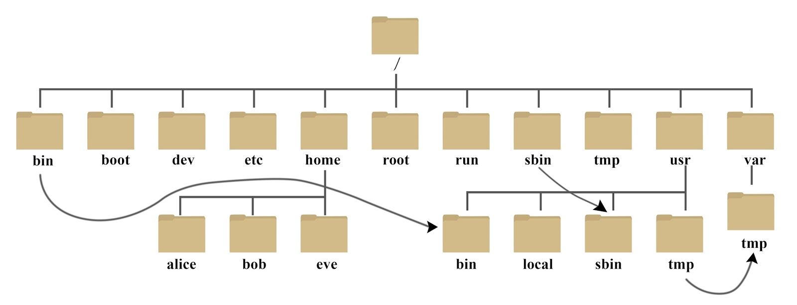
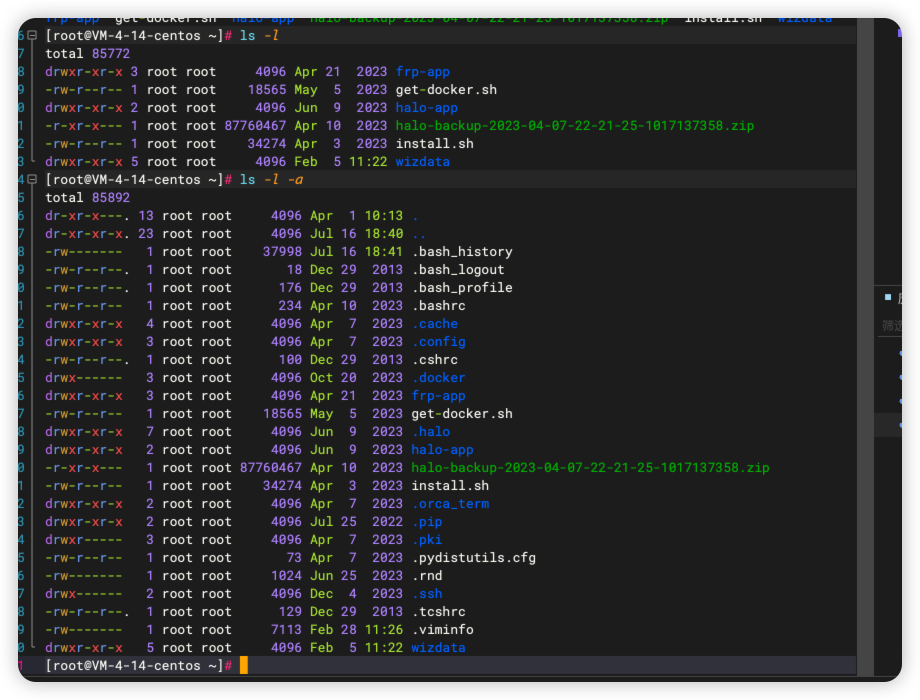

# 文件与目录
主要记录cd、touch、mv、cp等常用命令。
## Linux 目录结构
在Linux系统中目录结构是一个从上到下的树状结构，`/` 表示根目录。所有的IO设备都是以文件的形式表现出来。


简单介绍一下常用的目录。

1. /bin : bin 是 Binaries (二进制文件) 的缩写, 这个目录存放着最经常使用的命令。
   
2. /boot: 这里存放的是启动 Linux 时使用的一些核心文件，包括一些连接文件以及镜像文件。
   
3. /dev: dev 是 Device(设备) 的缩写, 该目录下存放的是 Linux 的外部设备，在 Linux 中访问设备的方式和访问文件的方式是相同的。
   
4. /etc: etc 是 Etcetera(等等) 的缩写,这个目录用来存放所有的系统管理所需要的配置文件和子目录。
   
5. /home: 用户的主目录，在 Linux 中，每个用户都有一个自己的目录，一般该目录名是以用户的账号命名的.
   
6. /lib: lib 是 Library(库) 的缩写这个目录里存放着系统最基本的动态连接共享库，其作用类似于 Windows 里的 DLL 文件。几乎所有的应用程序都需要用到这些共享库。
   
7. /lost+found: 这个目录一般情况下是空的，当系统非法关机后，这里就存放了一些文件。
   
8. /media: linux 系统会自动识别一些设备，例如U盘、光驱等等，当识别后，Linux 会把识别的设备挂载到这个目录下。
   
9.  /mnt: 系统提供该目录是为了让用户临时挂载别的文件系统的，我们可以将光驱挂载在 /mnt/ 上，然后进入该目录就可以查看光驱里的内容了。
    
10. /opt: opt 是 optional(可选) 的缩写，这是给主机额外安装软件所摆放的目录。比如你安装一个ORACLE数据库则就可以放到这个目录下。默认是空的。
    
11. /proc: proc 是 Processes(进程) 的缩写，/proc 是一种伪文件系统（也即虚拟文件系统），存储的是当前内核运行状态的一系列特殊文件，这个目录是一个虚拟的目录，它是系统内存的映射，我们可以通过直接访问这个目录来获取系统信息。
这个目录的内容不在硬盘上而是在内存里，我们也可以直接修改里面的某些文件，比如可以通过下面的命令来屏蔽主机的ping命令，使别人无法ping你的机器：

12. /root: 该目录为系统管理员，也称作超级权限者的用户主目录。

13. /tmp: tmp 是 temporary(临时) 的缩写这个目录是用来存放一些临时文件的。

14. /usr/bin: 系统用户使用的应用程序。

## 绝对路径、相对路径
* 相对路径：`/` 表示根目录，有`/`开始的目录地址表示绝对路径。
```shell
/home/user1
/opt/oracle/data
```
* 相对路径：现对于当前目录，通过`./` 和 `../` 来表示，如果路径开头没有表示，直接为目录则也表示当前目录开始。
```shell
# 表示当前目录
./

# 表示上一层目录
../
```

## CD 命令
通过cd命令可以进出目录。
```shell 
cd /home/user1

cd ../
```
`~` 进入用户目录
```shell
# 列如一个user1用户，其用户目录也是user1命名
cd ~
# 等价于
cd /home/user1
```
## LS 查看当前目录文件
```shell 
ls -l -a
```
* -l: 显示文件详细信息
* -a: 显示当前目录所有文件，包括隐藏文件


## touch 创建文件

```shell
touch aaa.txt
```