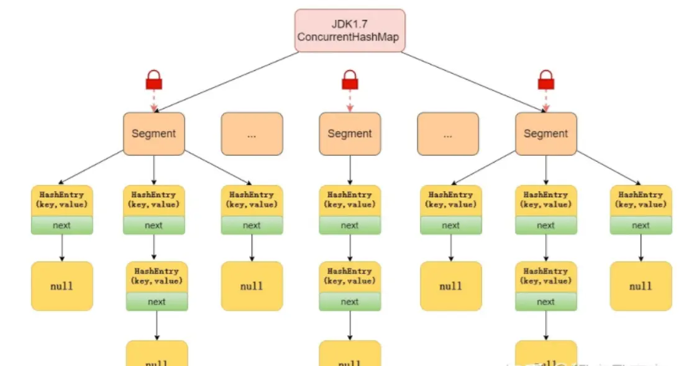

# JAVA中锁介绍

## 锁总结

| 序号 | 锁类型       | 实现类                                 |
| ---- | ------------ | -------------------------------------- |
| 1    | 乐观锁       | CAS                                    |
| 2    | 悲观锁       | synchronized、vector、hashtable        |
| 3    | 自旋锁       | CAS                                    |
| 4    | 可重入锁     | synchronized、Reentrantlock、Lock      |
| 5    | 读写锁       | ReentrantReadWriteLock，CopyOnWriteArrayList、CopyOnWriteArraySet |
| 6    | 公平锁       | Reentrantlock(true)                   |
| 7    | 非公平锁     | synchronized、reentrantlock(false)     |
| 8    | 共享锁       | ReentrantReadWriteLock中读锁           |
| 9    | 独占锁       | synchronized、vector、hashtable、ReentrantReadWriteLock中写锁 |
| 10   | 重量级锁     | synchronized                           |
| 11   | 轻量级锁     | 锁优化技术                             |
| 12   | 偏向锁       | 锁优化技术                             |
| 13   | 分段锁       | concurrentHashMap                      |
| 14   | 互斥锁       | synchronized                           |
| 15   | 同步锁       | synchronized                           |
| 16   | [死锁](/other/3.线程死锁的问题.html)          | 相互请求对方的资源                  |
| 17   | 锁粗化       | 锁优化技术                             |
| 18   | 锁消除       | 锁优化技术                             |

## 乐观锁与悲观锁
1. 乐观锁

乐观锁通过假设并发冲突发生概率较低来解决并发问题，主要通过数据版本控制实现。在更新数据前，会检查数据版本是否发生变化，只有在数据版本未变时才允许更新，这样可以避免覆盖其他线程所做的更改。

2. 悲观锁

悲观锁通常用于解决高并发下的数据安全问题，尤其是在写操作频繁的场景中。它通过锁定数据来防止其他线程并发修改，确保数据操作的原子性、一致性和隔离性。

## 自旋锁和CAS失败自旋

这里我把两个来比较是为了区别，其中`CAS失败自旋`不等于自旋锁，这是两种不同概念的。自旋锁是用于互斥锁定，而CAS是用于无锁并发操作。

1. 自旋锁
   
自旋锁是一种不使用操作系统级别的阻塞机制，而是通过让线程不断尝试获取锁的方式实现的锁机制。自旋锁在高并发环境下可以减少线程上下文切换的开销，但如果自旋时间过长，可能会导致CPU资源浪费。

2. CAS （一种无锁并发交换）
   
CAS（Compare-And-Swap）是一种用于实现无锁并发的原子操作，广泛应用于多线程编程中。CAS操作包含三个操作数：内存位置（V）、预期原值（A）和新值（B）。在交换失败时线程可以选择继续尝试`（自旋重试）或放弃操作`。

缺点：

* ABA问题：如果一个变量从A变为B然后又变回A，CAS操作无法检测到这种变化。解决方法之一是使用版本号。
* 自旋等待：CAS在失败时会自旋重试，可能会导致CPU资源浪费，尤其是在高并发情况下。
* 只能操作一个变量：CAS只能操作一个共享变量，无法直接处理多个变量的原子操作。

## 重入锁

可重入锁的主要特点是同一线程可以多次获得同一把锁，这对于避免死锁和提高编程灵活性具有重要意义。其内部维护了一个计数器，当前线程多次获取持有的锁时计数器自动+1，释放锁时-1，当计数器为0时则正在的释放锁。

可重入锁支持在一个已加锁的方法中调用另一个需要相同锁的方法。

JAVA中提供的一些可重入锁有：`ReentrantLock` 、`synchronized关键字`

优点：`避免死锁`（因线程等待自己持有的锁导致的死锁）,`编程灵活性`(支持在一个已加锁的方法中调用另一个需要相同锁的方法,提高代码的复用性和模块化)。

## 读写锁、共享锁、排它锁

1. 读写锁
   
读写锁是一种允许多个线程同时读取但只允许一个线程写入的锁。JAVA中`ReentrantReadWriteLock` 则是读写锁的一种，它分为两种锁类型：

* 读锁（共享锁）：允许多个读者同时访问资源，但当有写者请求写锁时，读者需要等待写者释放写锁。
* 写锁（排它锁）：只允许一个写者访问资源，写者在持有写锁时，其他读者和写者都必须等待。

2. 共享锁（适用于读多写少）
   
共享锁允许多个线程同事访问资源，但是不能去修改资源。通常用于读操作，如果资源被添加了排它锁（写锁）时，那么获取到共享锁的线程必须等待`写锁`释放完毕。

3. 排它锁

排它锁保正同一时间只有一个线程可以访问资源。当一个线程持有排它锁时，其它线程不能访问改资源包括读操作。

## 公平锁、非公平锁

公平锁在Java中是指多个线程按照请求锁的顺序来获取锁的机制。这种锁会维护一个有序队列，确保按照线程请求的顺序来分配锁，避免线程饥饿问题，根据是否按照`请求锁`的顺序`获取锁`来判断是否为公平锁。

ReentrantLock 可以通过构造函数来实现公平锁和非公平锁，默认是非公平锁。

* 请求顺序：公平锁通过维护一个等待队列来保证锁分配的顺序性
* 避免饥饿线程的问题，但是现对于的没有非公平锁效率高。

## 独占锁、互斥锁、同步锁

1. 独占锁

* 独占锁是一种思想： 只能有一个线程获取锁，以独占的方式持有锁。和悲观锁、互斥锁同义。
* Java中用到的独占锁： synchronized，ReentrantLock

2. 互斥锁

* 互斥锁与悲观锁、独占锁同义，表示某个资源只能被一个线程访问，其他线程不能访问。

    读-读互斥、读-写互斥、写-读互斥、写-写互斥

3. 同步锁

* 同步锁与互斥锁同义，表示并发执行的多个线程，在同一时间内只允许一个线程访问共享数据。

Java中的同步锁： synchronized

**总结：** 独占锁、互斥锁、同步锁含义上是一个意思

## 重量级锁、轻量级锁

1. 重量级锁

    重量级锁是一种称谓，特指需要操作系统支持来完成的锁机制称之为重量级锁。 synchronized 是java中重量级锁。

2. 轻量级锁

    轻量级锁是在无竞争的情况下使用CAS操作去消除同步使用的互斥量，轻量级是相对于使用操作系统互斥量来实现的重量级锁而言的。
    
    轻量级锁在没有多线程竞争的前提下，减少传统的重量级锁使用操作系统互斥量产生的性能消耗。如果出现两条以上的线程争用同一个锁的情况，那轻量级锁将不会有效，必须膨胀为重量级锁。

**优点：** 如果没有竞争，通过CAS操作成功避免了使用互斥量的开销。

**缺点：** 如果存在竞争，除了互斥量本身的开销外，还额外产生了CAS操作的开销，因此在有竞争的情况下，轻量级锁比传统的重量级锁更慢。

## 偏向锁

**含义：** 在无竞争的情况下把整个同步都消除掉，连CAS操作都不去做了。偏是指偏心，它的意思是 **这个锁会偏向于第一个获得它的线程** 。

如果在接下来的执行过程中，该锁一直没有被其他的线程获取。则持有偏向锁的线程将永远不需要再进行同步。

持有偏向锁的线程以后每次进入这个锁相关的同步块时，虚拟机都可以不再进行任何同步操作（例如加锁、解锁及对Mark Word的更新操作等）。

优点： 把整个同步都消除掉，连CAS操作都不去做了，优于轻量级锁。

缺点： 如果程序中大多数的锁都总是被多个不同的线程访问，那偏向锁就是多余的（**失效**）。

## 分段锁

**含义：** 分段锁是一种机制，java中ConcurrentHashMap在 jdk1.7时通过分段锁来解决线程安全问题。

它内部细分了若干个小的 HashMap，称之为段(Segment)。默认情况下一个 ConcurrentHashMap 被进一步细分为 16 个段，既就是锁的并发度。

如果需要在 ConcurrentHashMap 添加一项key-value，并不是将整个 HashMap 加锁，而是首先根据 hashcode 得到该key-value应该存放在哪个段中，然后对该段加锁，并完成 put 操作。

在多线程环境中，如果多个线程同时进行put操作，只要被加入的key-value不存放在同一个段中，则线程间可以做到真正的并行。

**线程安全：** ConcurrentHashMap 是一个 Segment 数组， Segment 通过继承ReentrantLock 来进行加锁，所以每次需要加锁的操作锁住的是一个 segment，这样只要保证每个 Segment 是线程安全的，也就实现了全局的线程安全

## 锁粗化、锁消除

**锁粗化：**

&nbsp;&nbsp;&nbsp;&nbsp;&nbsp;&nbsp;&nbsp;锁粗化是一种优化手段，如果一系列的连续操作都对同一个对象反复加锁和解锁，就算真的没有线程竞争，频繁地进行互斥同步操作将会导致不必要的性能损耗，所以就采取了一种方
案：把加锁的范围扩展（粗化）到整个操作序列的外部，这样加锁解锁的频率就会大大降低，从而减少了性能损耗。

&nbsp;&nbsp;&nbsp;&nbsp;&nbsp;&nbsp;&nbsp;在锁竞争激烈的情况下，可以将锁的范围增大从而减少频繁竞争锁的情况。

**锁消除：**

**含义：** 就是把锁干掉。当Java虚拟机运行时发现有些共享数据不会被线程竞争时就可以进行锁消除。

那如何判断共享数据不会被线程竞争？

利用逃逸分析技术：分析对象的作用域，如果对象在A方法中定义后，被作为参数传递到B方法中，则称为方法逃逸；如果被其他线程访问，则称为线程逃逸。

在堆上的某个数据不会逃逸出去被其他线程访问到，就可以把它当作栈上数据对待，认为它是线程私有的，同步加锁就不需要了。