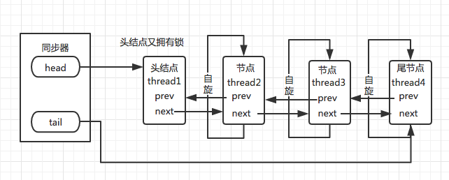

# AQS 介绍

## 什么是AQS

AQS（AbstractQueuedSynchronizer）是Java并发包（java.util.concurrent）中的一个基础框架，用于构建锁和同步器。AQS提供了一种基于FIFO（先进先出）队列的机制，用于管理同步状态、线程的排队和阻塞。许多并发工具类（如ReentrantLock、Semaphore、CountDownLatch等）都是基于AQS实现的。

## AQS的核心概念

* 同步状态（state）：AQS通过一个整数来表示同步状态。具体同步器的语义通过继承AQS并重写相关方法来实现。
* 等待队列（wait queue）：AQS维护一个FIFO队列，记录那些获取同步状态失败的线程。每个线程在队列中都是一个节点（Node），这些节点会被挂起并等待唤醒。
* 独占模式（exclusive mode）和共享模式（shared mode）：AQS支持独占和共享两种模式：
* 独占模式：只有一个线程能获取同步状态。例如，ReentrantLock。
* 共享模式：多个线程可以共享同步状态。例如，Semaphore。

## AQS的工作原理
AQS通过一个FIFO队列管理被阻塞的线程，具体步骤如下：
1. 获取同步状态：
   * 如果成功，线程可以继续执行。
   * 如果失败，线程被放入等待队列，并进入阻塞状态。
2. 释放同步状态：
   * 释放同步状态后，会唤醒等待队列中的一个或多个线程，让它们尝试获取同步状态。

## 其它文章描述的原理

AQS 核心思想是，如果被请求的共享资源空闲，则将当前请求资源的线程设置为有效的工作线程，并且将共享资源设置为锁定状态。

如果被请求的共享资源被占用，那么就需要一套线程阻塞等待以及被唤醒 时锁分配的机制，这个机制 AQS 是用 CLH 队列锁实现的，即将暂时获取不到锁的线程加入到队列中。

