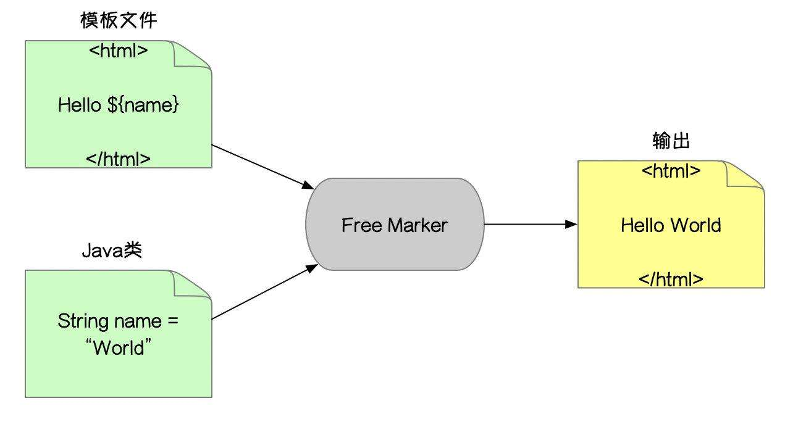

# 一文解决Freemarke
## 概念

&emsp;FreeMarker 是一款 模板引擎： 即一种基于模板和要改变的数据， 并用来生成输出文本(HTML网页，电子邮件，配 置文件，源代码等)的通用工具。 是一个Java类库。 

&emsp;FreeMarker 被设计用来生成 HTML Web 页面，特别是基于 MVC 模式的应用程序，将视图从业务逻辑中抽离处理， 业务中不再包括视图的展示，而是将视图交给 FreeMarker 来输出。虽然 FreeMarker 具有一些编程的能力，但通常 由 Java 程序准备要显示的数据，由 FreeMarker 生成页面。通过模板显示准备的数据(如图):


需要注意:

* FreeMarker不是一个Web应用框架，而适合作为Web应用框架一个组
* FreeMarker与容器无关，因为它并不知道HTTP或Servlet。FreeMarker同样可以应用于非Web应用程序环境
* FreeMarker更适合作为Model2框架（如Struts）的视图组件，你也可以在模板中使用JSP标记库。 


## ${变量} 表达式

1. 后端返回数据Model

```java
request.setAttribute("meg","hello word");
```

2. 页面使用 **${}** 语法

```HTML
<h1>${msg}</h1>
```

3. 渲染后显示

```java
hello word
```

## freemarker数据类型

&emsp;freemarker模板中的数据类型主要由如下几种:

* 布尔型：等价于 Java 的 Boolean 类型，不同的是**不能直接输出**，可转换为字符串输出 

* 日期型：等价于 java 的 Date 类型，不同的是**不能直接输出**，需要转换成字符串再输出 

* 数值型：等价于 java 中的 int,float,double 等数值类型 有三种显示形式：数值型(默认)、货币型、百分比型 

* 字符型：等价于 java 中的字符串，有很多内置函数 

* sequence 类型：等价于 java 中的数组，list，set 等集合类型 
* hash 类型：等价于 java 中的 Map 类型

## 布尔型

1. 数据

```java
request.setAttribute("flag", true);
```

2. 获取

```java
// 方式一
${flag?c}

// 方式二 
${flag?string}

// 方式三
${flag?string("yes","no")}
```

&emsp;这里用到的是freemarker的内置函数，如 **?c** 和 **?string**,前面说到了，布尔型的数据是不能直接输出的，需要对其进行转换，转换为字符串才能正常输出。所以 **?c** 和 **?string**都是把其它类型转换为字符串类型的内置函数。

## 日期型

1. 数据

```java
request.setAttribute("createDate",new Date());
```

2. 获取

```java
<#-- 错误示例 --> 
${createDate}

<#-- 输出日期格式 --> 
${createDate?date}
  
<#-- 输出时间格式 --> 
${createDate?time}

<#-- 输出日期时间格式 --> 
${createDate?datetime} 

<#-- 输出格式化日期格式 --> 
${createDate?string("yyyy年MM月dd日 HH:mm:ss")}

```

&emsp;在错误实例中是由于日期类型是无法直接显示的，所以通过内置函数格式化输出。

## 数值型

1. 数据

```java
// 数值型 
request.setAttribute("age",18); 

// 数值型 
request.setAttribute("salary",10000); 

// 浮点型
request.setAttribute("avg",0.545); 

```

2. 获取

```java
<#-- 直接输出数值型 --> 
${age}

${salary}

<#-- 将数值转换成字符串输出 --> 
${salary?c}

<#-- 将数值转换成货币类型的字符串输出 --> 
${salary?string.currency}

<#-- 将数值转换成百分比类型的字符串输出 --> 
${avg?string.percent}

<#-- 将浮点型数值保留指定小数位输出 （##表示保留两位小数）--> 
${avg?string["0.##"]}

```

其中:

* ?string.currency：把数值类型转为货币类型输出
* ?string.percent: 将数值类型转为百分比类型输出
* ?string["0.##"]：将数值精确到多少位小数

## 字符型

1. 数据

```java
request.setAttribute("msg","hello");
request.setAttribute("msg_two","freemarker");
```

2. 获取

```java
<#-- 直接输出 --> 
${msg}---${msg_two}

<#-- 截取字符串(左闭右开) --> 
${msg?sibstromg(0,2)}

<#-- 首字母小写输出 --> 
${msg?uncap_first}

<#-- 首字母大写输出 --> 
${msg?cap_first}

<#-- 字母转小写输出 --> 
${msg?lower_case}

<#-- 字母转大写输出 -->
${msg?upper_case} 

<#--获取字符串长度 -->
${msg?length}

<#-- 是否以指定字符开头 -->
${msg?starts_with("xx")?string}

<#-- 是否已指定字符结尾 -->
${msg?ends_with("xx")?string}

<#-- 获取指定字符的所引 -->
${msg?index_of("xx")} 

<#-- 去除字符串前后空格 -->
${msg?trim}

<#-- 替换指定字符串 -->
${replace("xx","xx")}     
```

&emsp;这些主要都是关于字符串的内置函数使用方法，这里列取了常用的内置函数，需要查看更多的内置函数需要去官网查询。

## sequence型

&emsp;sequence类似于java中的数组，list,set类型

1. 数据

```java
// 数组操作 
String[] stars = new String[]{"周杰伦","林俊杰","陈奕迅","五月天"}; request.setAttribute("stars",stars);

// List操作 
List<String> citys = Arrays.asList("上海","北京","杭州","深圳"); request.setAttribute("cityList",citys);

// JavaBean集合 
List<User> userList = new ArrayList<>(); 
userList.add(new User(1,"zhangsan",22)); 
userList.add(new User(2,"lisi",18)); 
userList.add(new User(3,"wangwu",20)); 
request.setAttribute("userList",userList);
```

2. 获取

* 数组操作

```java
<#list stars as star>    
    下标：${star?index} -- 名字：${star} <br> 
</#list> 

<#--数组的长度 -->
${stars?size}  

<#-- 获取第一个元素 -->
${stars?first} 

<#-- 获取最后一个元素 --> 
${stars?last} 
```

* List操作

```html
<#list cityList as city >    
    ${city} <br> 
</#list> 

<#--List的大小 -->
${cityList?size} 

<#-- 倒序输出 -->
<#list cityList?reverse as city >    
    ${city} 
</#list>

<#-- 升序输出 --> 
<#list cityList?sort as city >    
    ${city} 
</#list>

<#-- 降序输出 --> 
<#list cityList?sort?reverse as city >    
    ${city} 
</#list>
```

* JavaBean集合

```html
<#list userList as user>    
    编号：${user.userId}
    姓名：${user.uname}
    年龄：${user.uage} 
</#list>

<#-- 按照指定字段名排序 --> 
<#list userList?sort_by("uage") as user>    
    ${user.uname}
</#list>
```

&emsp;对于sequence类型的数据，要通过list标签循环输出数据

## hash 类型

&emsp;hash类型相当与java中的map类型

1. 数据

```java
// Map操作 Map<String,String> cityMap = new HashMap<>(); cityMap.put("sh","上海"); 
cityMap.put("bj","北京"); 
cityMap.put("sz","深圳"); 
request.setAttribute("cityMap",cityMap);
```

2. 获取

```java
<#-- key遍历输出 --> 
<#list cityMap?keys as key>    
    ${key} -- ${cityMap[key]}
</#list>

<#-- value遍历输出 --> 
<#list cityMap?values as value>    
    ${value}
</#list>
```

# 常用指令

## assign 自定义变量指令

&emsp;使用 assign 指令你可以创建一个新的变量， 或者替换一个已经存在的变量。

**案例**

```java
// 通过assign创建一个str变量，变量值为hello
<#assign str="hello"> 

//通过${}表达式获取
${str}

// 创建num变量和names数组类型比变量
<#assign num=1 names=["zhangsan","lisi","wangwu"] > 
${num}

// 通过join内置函数转为字符串输出
${names?join(",")}
```

## if elseif else 逻辑判断指令

**案例**

```java
// 创建一个变量score，值为80

<#assign score = 80>

<#if score lt 60>

    低于60分哦

    <#elseif score == 60>

	分不在高，及格就行

    <#elseif score gt 60 && score lt 80>

	 哎哟不错哦

     <#else>

	 非常棒!

</#if>
```

> 当你想测试是否 x > 0 或 x >= 0，编写 <#if x > 0> 和 <#if x >= 0> 是错误的， 因为第一个 > 会结束 #if 标签。要这么来做，可以编写 <#if x gt 0> 或 <#if gte 0>。也请注意，如果比较发生在括号内部，那么就没有这样的问题，比如 <#if foo.bar(x > 0)> 就会得到想要的结果。
> **注意**：

* "gt"相当于">"
* "gte"相当于">="
* "lt"相等于"<"
* "lte"相等于"<="

## list 遍历指令 

&emsp;可以使用 list 指令来对序列进行遍历
**案例**

```java
// 定义一个数组
<#assign users = ["张三","李四","王五"]> 

<#-- 遍历序列 -->
<#list users as user>    
    ${user} 
</#list>

// 定义一个空数据的序列数组 
<#assign users3 = []> 

<#-- 当序列没有数据项时，使用默认信息 --> 
<#list users3 as user>    
    ${user}    
<#else>        
    当前没有数据！ 
</#list>

```

**注意**：如果序列不存在会直接报错，可以通过if标签加以判断

* 判空操作:users??

## acro 自定义指令(宏)

&emsp;通过acro指令定义自己的指令，有点类似于函数

**基本语法**

```java
1.基本使用
    格式:
	 <#macro 指令名>                    
	    指令内容                
         </#macro> 
    使用:
         <@指令名></@指令名>
2.有参数的自定义指令
    格式:
	 <#macro 指令名 参数名1 参数名2>                    
	    指令内容                
         </#macro> 
    使用：                
	 <@指令名 参数名1=参数值1 参数名2=参数值2></@指令名>
 
```

**案例**

```java
<#-- 定义基本的自定义指令 --> 
<#macro address>    
	© 1999–2015 The FreeMarker Project. All rights reserved. </#macro> 

<#-- 使用指令2次 --> 
<@address></@address>
<@address></@address> 
```

**注意**:

* 指令可以被多次使用。            
* 自定义指令中可以包含字符串，也可包含内置指令 

## nested占位指令

**案例**

```java
<#macro test>    
    这是一段文本！    
    <#nested> 
</#macro> 

<@test>
  <h4>这是文本后面的内容！</h4>
</@test>

```

&emsp; 这个指令有点不好用语言描述，通过案例来说明一个，这里通过macro创建一个test的宏，在这个宏里面有一个nested占位符。

&emsp; 通过<@test></@test>使用这个宏，并在<@test></@test>内编写内容，这些内容渲染后会全部插入到占位符那。

## import导入指令

> import 指令可以引入一个库。也就是说，它创建一个新的命名空间， 然后在那个命名空间中执行给定路径的模板。可以使用引入的空间中的指令。

比如有一个commons.ftl模板文件

```java
<#macro msg>
    hello world
</#macro>
```

在test.ftl模板文件中引入

```java
<#-- 导入命名空间 --> 
<#import "commons.ftl" as common> 

<#-- 使用命名空间中的指令 --> 
<@common.cfb></@common.cfb>
```

$emsp;这里有点类似于组件化include

## include 包含指令

> 可以使用 include 指令在你的模板中插入另外一个 FreeMarker 模板文件或其它文件。被包含模板的输出格式是在 include 标签出现的位置插入的。 被包含的文件和包含它的模板共享变量，就像是被复制粘贴进去的一样。

代码:

```java
<#--包含指令(引入其他页面文件) include--> 
<#--html文件--> 
<#include "test.html"> 

<#--freemarker文件--> 
<#include "test.ftl"> 

<#--text文件--> 
<#include "test.txt"> 
```

&emsp;这里和导入指令是有区别的，包含指令是直接包含引入文件的所有内容，并且共享变量。

# 说在最后

&emsp;当然，说一篇文章就解决freemarker是不可能的，至于起这个标题完全是吸引一下兴趣，本篇文章所说的内容都是基本的使用和一些常用的指令方法等。想要完全学会那肯定还是要去官网的。