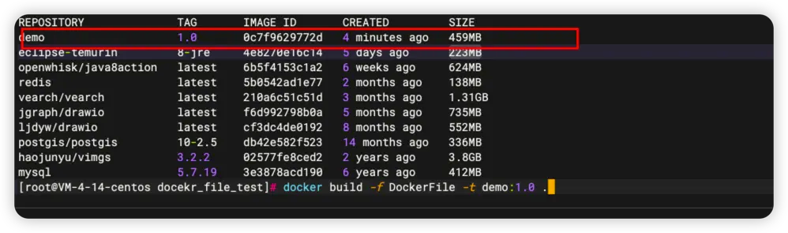

# DockerFile 实战
> 我会使用一个jdk基础的镜像，将自己创建的helloworld.jar 文件构建一个镜像。在启动容器时映射端口。容器后访问服务，服务会获取配置的环境变量返回给我

## 准备的JAR
只有两个接口，第一个接口可以获取配置文件中定义的值，第二个接口可以获取系统中指定的环境变量值。

1. Controller
```
@RestController
@RequestMapping
public class DemoController {

    @Value("${applicationName}")
    private String applicationName;

    @GetMapping("test1")
    public String getApplicationName() {
        return applicationName;
    }

    @GetMapping("env")
    public String getEnv(String envKey) {
        String property = System.getProperty(envKey);
        if (property == null) {
            return "未查询到环境变量";
        }
        return property;
    }
}

```

2. application.yml
```
applicationName: "dockerFile测试"
```
[docker_file_demo-0.0.1.jar](https://www.yuque.com/attachments/yuque/0/2023/jar/1541192/1699338238736-b17592be-ffdb-4ad5-82f2-52bae7ce5cb8.jar?_lake_card=%7B%22src%22%3A%22https%3A%2F%2Fwww.yuque.com%2Fattachments%2Fyuque%2F0%2F2023%2Fjar%2F1541192%2F1699338238736-b17592be-ffdb-4ad5-82f2-52bae7ce5cb8.jar%22%2C%22name%22%3A%22docker_file_demo-0.0.1.jar%22%2C%22size%22%3A17758528%2C%22ext%22%3A%22jar%22%2C%22source%22%3A%22%22%2C%22status%22%3A%22done%22%2C%22download%22%3Atrue%2C%22taskId%22%3A%22ue0ccca6f-4647-4e6e-b76b-7db0b084507%22%2C%22taskType%22%3A%22upload%22%2C%22type%22%3A%22application%2Fjava-archive%22%2C%22__spacing%22%3A%22both%22%2C%22mode%22%3A%22title%22%2C%22id%22%3A%22u097f6a13%22%2C%22margin%22%3A%7B%22top%22%3Atrue%2C%22bottom%22%3Atrue%7D%2C%22card%22%3A%22file%22%7D)

## DockerFile
```
FROM fabletang/jre8-alpine

# 设定时区、中文
ENV TZ=Asia/Shanghai
RUN ln -snf /usr/share/zoneinfo/$TZ /etc/localtime && echo $TZ > /etc/timezone \
&& apt-get update && apt-get install -y locales && locale-gen zh_CN.UTF-8 \
&& update-locale LANG=zh_CN.UTF-8 && rm -rf /var/lib/apt/lists/*
ENV LANG=zh_CN.UTF-8 \
    LANGUAGE=zh_CN:zh \
    LC_ALL=zh_CN.UTF-8

# 工作目录
WORKDIR /AppService

# 定义一个环境变量，后面看看通过java服务能否获取到
ENV TEST=测试


# 复制jar到工作目录中
COPY docker_file_demo-0.0.1.jar ./docker_file_demo_1.0.jar


CMD ["java", "-jar", "./docker_file_demo_1.0.jar"]
```
## 构建镜像
```
docker build -f DockerFile -t demo:1.0 .
```

- -f: 指定dockerFile文件
- -t: 构建镜像的名称和标签
- . : 表示当前目录（默认）



## 启动RUN
```
 docker run -p 18080:8080 --name demo -d  demo:1.0 
```
## 映射外部配置文件

1. 修改dockerFile文件，修改CMD指令
```json
CMD ["java", "-jar", "./docker_file_demo_1.0.jar","--spring.profiles.active=test"]
```

2. 首先看一下配置文件中的内容
```json
applicationName: 你获取的是外部的配置文件
```

2. 通过访问 **ip:端口/test1**  获取配置文件中的内容，来判断是否使用的是外部的配置文件
3. 创建容器并制定外部配置文件
```json
docker run -d --name demo1.7 -p 18080:8080 -v /AppService/docker/docker_file/docekr_file_test/application-test.yml:/AppService/application-test.yml demo:1.7
```

4. 验证结果（验证成功）
```json
[root@VM-4-14-centos docekr_file_test]# curl 127.0.0.1:18080/test1
你获取的是外部的配置文件
[root@VM-4-14-centos docekr_file_test]# 
```
