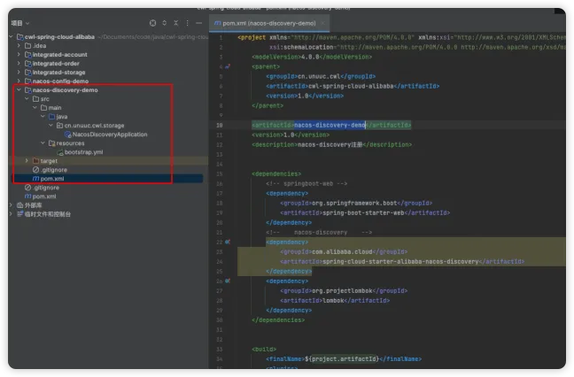
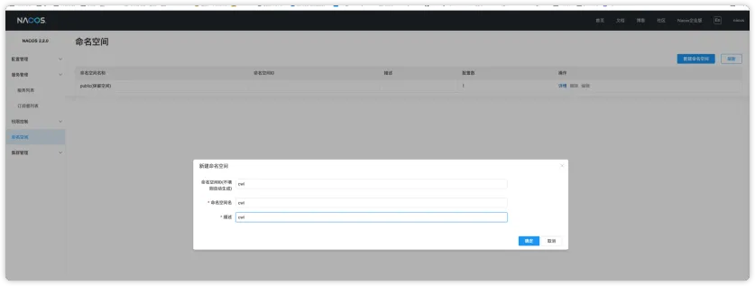
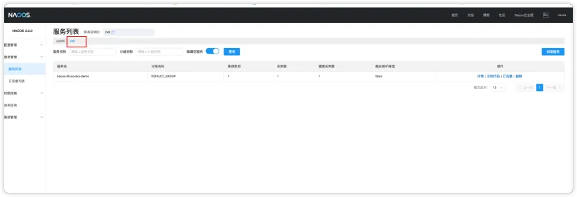

# Nacos 注册中心

## 创建nacos-discovery-demo子模块



## 添加nacos注册发现依赖
> 无需指定版本号，因为在父模块中添加了版本仲裁

```
<!--    nacos-discovery    -->
<dependency>
    <groupId>com.alibaba.cloud</groupId>
    <artifactId>spring-cloud-starter-alibaba-nacos-discovery</artifactId>
</dependency>
```
## 新建bootstrap.yml文件
> 这里建议最好使用bootstrap.yml文件，因为后面还会操作nacos配置中心功能，由于springboot加载配置文件的优先级问题。

```
server:
  port: 8084

spring:
  application:
    name: nacos-discovery-demo
  cloud:
    nacos:
      discovery:
        # 命名空间，用于区分不同的项目
        namespace: cwl
        # 服务注册地址
        server-addr: 192.168.101.104:8848
        username: nacos
        password: nacos
        # 是否注册服务到nacos
        enabled: true

```
## 命名空间问题
> 默认是public的命名空间，如何在bootstrap.yml中设置命名空间配置，那么需要手动在nacos控制台中添加。默认不会自动生成



## 启动类添加注解
```
@SpringBootApplication
@EnableDiscoveryClient
public class NacosDiscoveryApplication {

    public static void main(String[] args) {
        SpringApplication.run(NacosDiscoveryApplication.class, args);
    }
}
```
## 启动项目Nacos控制台查看效果


