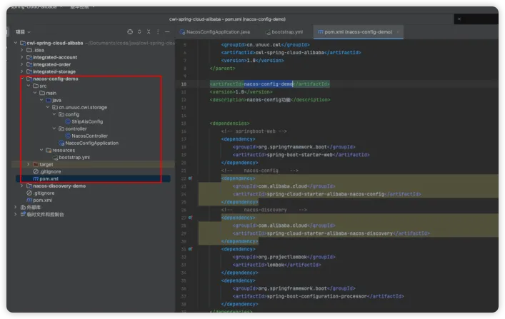
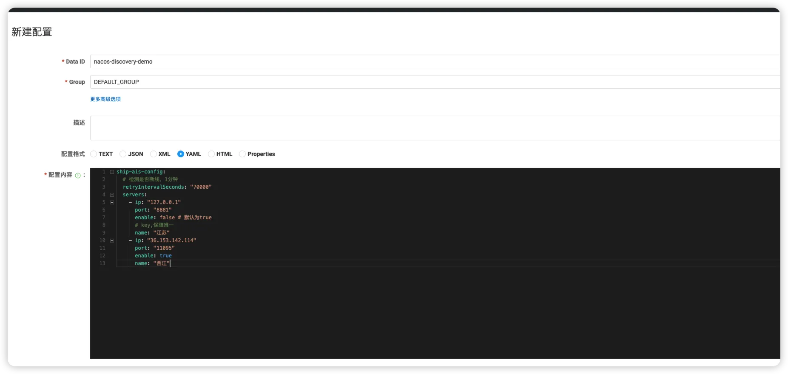
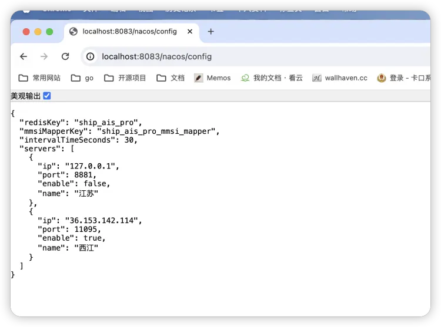
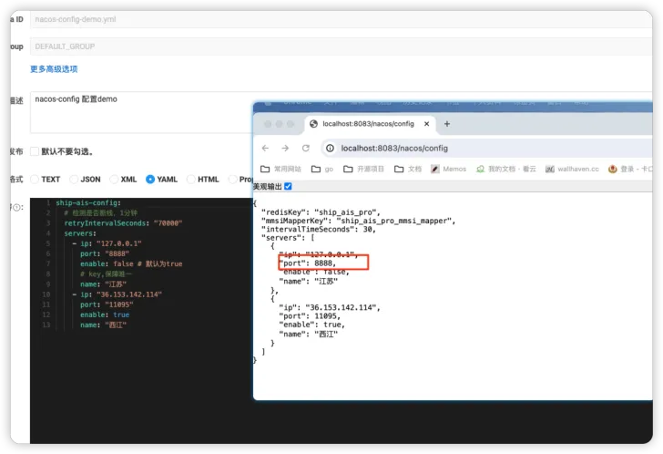

# Nacos 配置中心

## 新建子模块nacos-config-demo



## 添加Nacos 配置中心依赖
```
<!--    nacos-config    -->
<dependency>
    <groupId>com.alibaba.cloud</groupId>
    <artifactId>spring-cloud-starter-alibaba-nacos-config</artifactId>
</dependency>
```
## 新增ShipAisConfig配置类，用于绑定自定义配置
```
package cn.unuuc.cwl.storage.config;

import lombok.Data;
import org.springframework.boot.context.properties.ConfigurationProperties;
import org.springframework.stereotype.Component;

import java.util.List;

/**
 * @author 陈威龙
 * @date 2024/1/11 13:53
 * 十年生死两茫茫，写程序，到天亮。
 * 千行代码，Bug何处藏。
 * 纵使上线又怎样，朝令改，夕断肠。
 * 领导每天新想法，天天改，日日忙。
 * 相顾无言，惟有泪千行。
 * 每晚灯火阑珊处，程序员，加班狂。
 */

@Component
@ConfigurationProperties(prefix = "ship-ais-config")
@Data
public class ShipAisConfig {

    /**
     * redis key
     */
    private String redisKey = "ship_ais_pro";

    /**
     * mmsi-shipName 映射，存入redis中的key
     */
    private String mmsiMapperKey = "ship_ais_pro_mmsi_mapper";

    /**
     * 同一ais数据,间隔事件内忽略，默认30s
     */
    private Integer intervalTimeSeconds = 30;


    /**
     * 服务连接信息
     */
    private List<Server> servers;

    @Data
    public static class Server {

        /**
         * ip地址:192.168.0.2
         */
        private String ip;

        /**
         * port端口:8888
         */
        private Integer port;

        /**
         * 启动状态，默认开启
         */
        private Boolean enable = true;

        /**
         * 连接信息key,需要保证唯一
         */
        private String name;

    }
}
```
## 创建controller，用于访问测试使用
```
@RestController
@RequestMapping("nacos")
public class NacosController {

    @Resource
    private ShipAisConfig shipAisConfig;

    @GetMapping("config")
    public ShipAisConfig shipAisConfig() {
        return shipAisConfig;
    }
}
```
## bootstrap.yml配置文件
> 这里没有自定义命名空间，默认是public命名空间

```
server:
  port: 8083

spring:
  application:
    name: nacos-config-demo
  cloud:
    nacos:
      config:
        # 配置中心地址
        server-addr: 192.168.101.104:8848
        username: nacos
        password: nacos
        enabled: true
        # 配置文件格式
        file-extension: yml
```
## nacos控制台新增配置



配置内容：
```
ship-ais-config:
  # 检测是否断线，1分钟
  retryIntervalSeconds: "70000"
  servers:
    - ip: "127.0.0.1"
      port: "8881"
      enable: false # 默认为true
      # key,保障唯一
      name: "江苏"
    - ip: "36.153.142.114"
      port: "11095"
      enable: true
      name: "西江"
```
** data_id 命名规则：**
> ${spring.application.name}-${spring.profiles.active}.yml

如果没有设置active，那么中间的“-”将忽略，所以如上图所示，创建的data_id命名为：nacos-discovery-demo
## 启动服务访问

1. 访问测试



2. 在nacos控制台修改配置，验证是否实时更新


