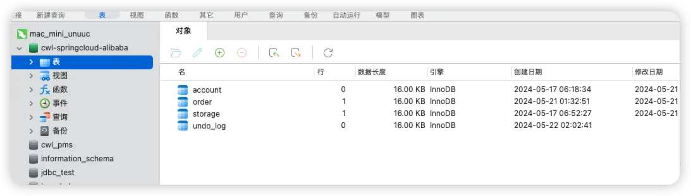
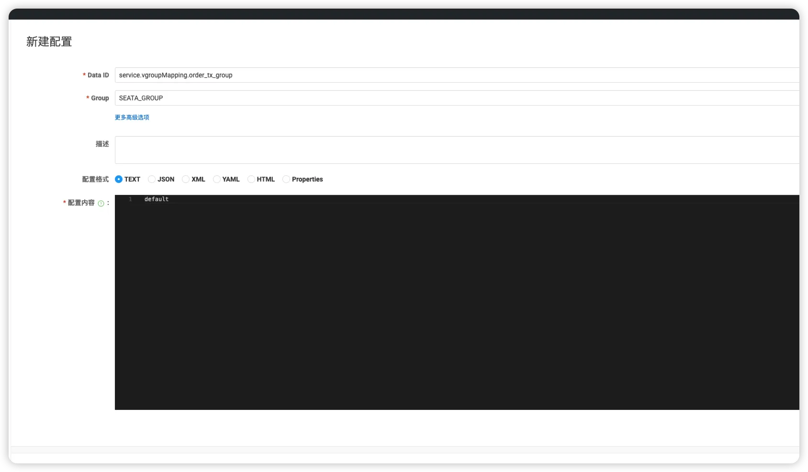
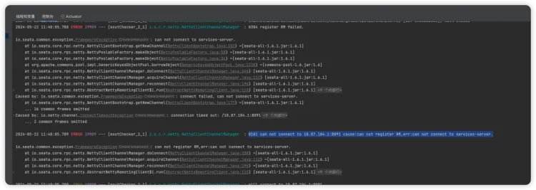
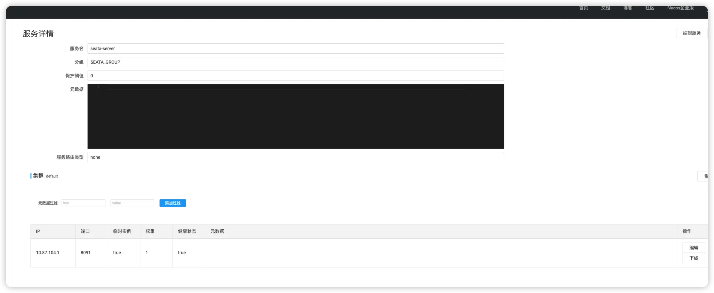
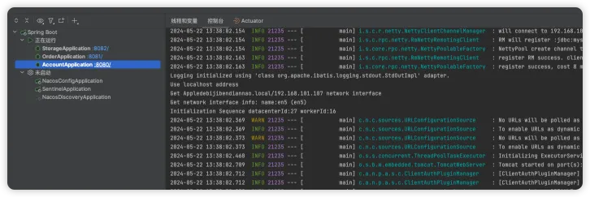
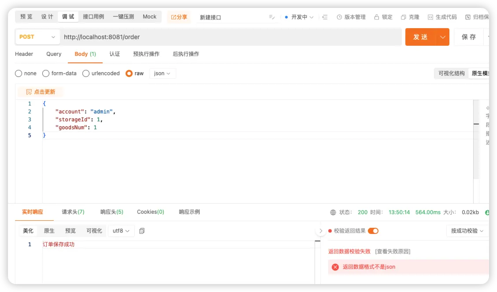
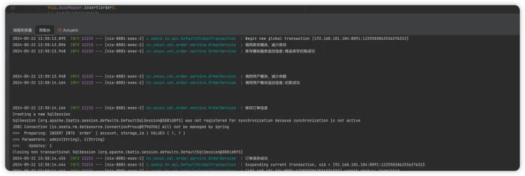
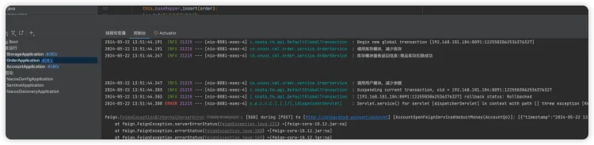
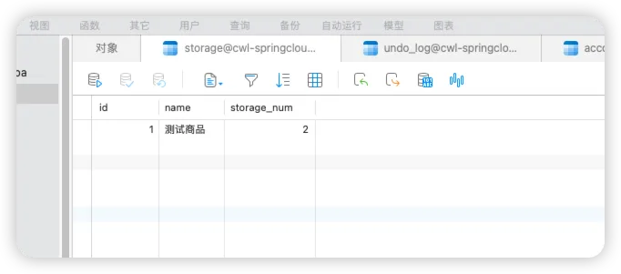

# Seata 分布式事务

## 在服务数据库中新增表
> seata分布式事务需要使用到这个表

```
-- 注意此处0.3.0+ 增加唯一索引 ux_undo_log
CREATE TABLE `undo_log` (
  `id` bigint(20) NOT NULL AUTO_INCREMENT,
  `branch_id` bigint(20) NOT NULL,
  `xid` varchar(100) NOT NULL,
  `context` varchar(128) NOT NULL,
  `rollback_info` longblob NOT NULL,
  `log_status` int(11) NOT NULL,
  `log_created` datetime NOT NULL,
  `log_modified` datetime NOT NULL,
  `ext` varchar(100) DEFAULT NULL,
  PRIMARY KEY (`id`),
  UNIQUE KEY `ux_undo_log` (`xid`,`branch_id`)
) ENGINE=InnoDB AUTO_INCREMENT=1 DEFAULT CHARSET=utf8;
```

## 添加seata依赖
```
<dependency>
    <groupId>com.alibaba.cloud</groupId>
    <artifactId>spring-cloud-starter-alibaba-seata</artifactId>
</dependency>
```
## 修改bootstrap.yml
> 这里最好还是看官方的github示例中配置，网上说的要么是版本不对要么是其它问题，这里我卡了好久

```
seata:
  enabled: true
  application-id: ${spring.application.name}
  tx-service-group: default_tx_group
  config:
    type: nacos
    nacos:
      server-addr: ${spring.cloud.nacos.discovery.server-addr}
      namespace: 389ba5a3-dcea-463e-a3ee-8a11251434cc
      group: SEATA_GROUP
      username: ${spring.cloud.nacos.discovery.username}
      password: ${spring.cloud.nacos.discovery.password}
  registry:
    type: nacos
    nacos:
      server-addr: ${spring.cloud.nacos.discovery.server-addr}
      namespace: 389ba5a3-dcea-463e-a3ee-8a11251434cc
      group: SEATA_GROUP
      username: ${spring.cloud.nacos.discovery.username}
      password: ${spring.cloud.nacos.discovery.password}

feign:
  sentinel:
    enabled: true # 开启openfeign中的sentinel

```
## 启动后提示无配置文件警告

1. service.vgroupMapping.xxxxx 
> 2024-05-22 10:23:37.657 ERROR 17919 --- [eoutChecker_2_1] i.s.c.r.netty.NettyClientChannelManager  : can not get cluster name in registry config 'service.vgroupMapping.account_tx_group', please make sure registry config correct
> 2024-05-22 10:23:47.375 ERROR 17919 --- [eoutChecker_1_1] i.s.c.r.netty.NettyClientChannelManager  : can not get cluster name in registry config 'service.vgroupMapping.account_tx_group', please make sure registry config correct

在nacos中添加配置，其它服务也是这样



## 无法连接seata服务端



问题原因：
> 查看nacos控制台发现seata-server服务ip为公网的，可以通过指定IP命令启动

```
bash seata-server.sh -h “自己IP” -p 8091

# 我的启动命令，先kill掉已运行的
bash seata-server.sh -h 192.168.101.104 -p 8091
```


## 心酸、终于运行正常了



## 修改service方法，添加注解
```
@GlobalLock
@GlobalTransactional
public String saveOrder(OrderQo orderQo) {
    
}
```
> @GlobalTransactional：
> 当一个方法被 “@GlobalTransactional” 注解标记时，Seata 将自动为该方法创建一个全局事务上下文，该事务上下文会在方法执行过程中传播到其他被调用的事务性质的方法。如果在全局事务中的任何一个参与者（包括被标记的方法以及其内部调用的其他事务性质的方法）出现异常或者显式地标记回滚，则整个全局事务将回滚，保证了数据的一致性。
> @GlobalLock：
> 当一个方法被 “@GlobalLock” 注解标记时，Seata 会在事务发起时尝试获取全局锁。如果全局锁当前没有被其他事务持有，则当前事务可以继续执行被标记的方法。而如果全局锁已经被其他事务持有，则当前事务会等待，直到全局锁被释放为止。这样就保证了同一时刻只有一个事务能够执行被标记的方法，避免了潜在的并发冲突。

## 测试

1. 初始化库表中余额为3，库存数量为2
2. 第一次调用





1. 第二次调用，分布式事务，那么会减少库存但是由于余额不足会发生事务回滚
> 可以根据截图中清楚地看到，先减少了库存，但由于余额不足发生了异常所以事务回滚了，并且库存中的数量没有变化。



