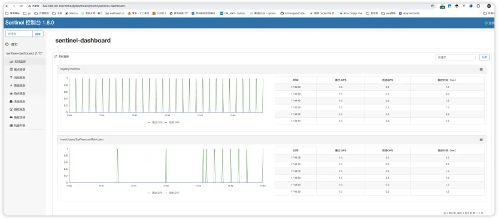
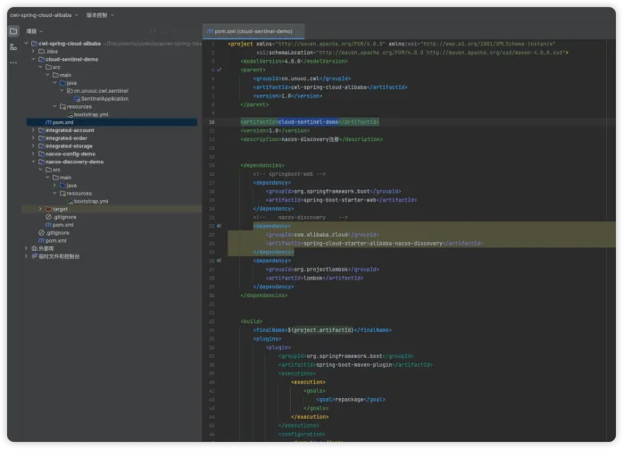
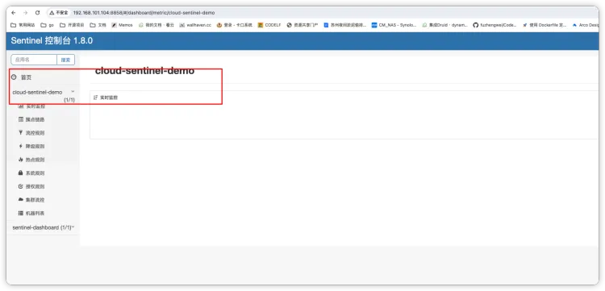
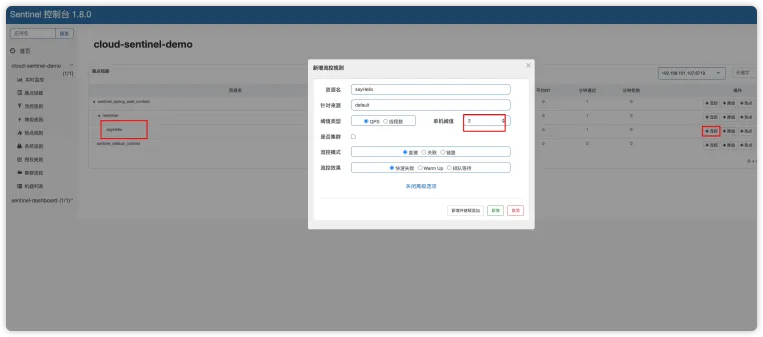
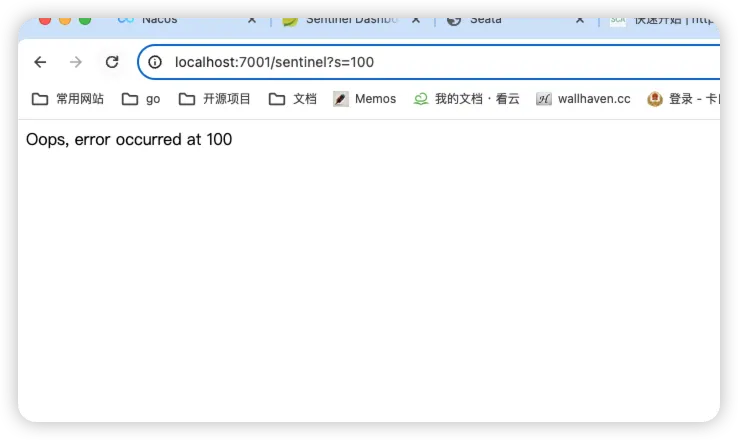

# Sentinel 熔断限流

## Sentinel控制台搭建
> 我这里为了方便使用docker-compose方式搭建

```
version: '3.1' 
services:
    sentinel-dashboard:
        image: 'bladex/sentinel-dashboard:latest'
        environment:
            - AUTH_PASSWORD=cwljxf1025.
            - AUTH_USERNAME=admin
        container_name: sentinel-dashboard
        ports:
            - '8858:8858'
            - '8719:8719'
```


## 新建cloud-sentinel-demo模块



1. pom文件,添加web、sentinel、nacos-discovery相关依赖
```
<project xmlns="http://maven.apache.org/POM/4.0.0" xmlns:xsi="http://www.w3.org/2001/XMLSchema-instance"
         xsi:schemaLocation="http://maven.apache.org/POM/4.0.0 http://maven.apache.org/xsd/maven-4.0.0.xsd">
    <modelVersion>4.0.0</modelVersion>
    <parent>
        <groupId>cn.unuuc.cwl</groupId>
        <artifactId>cwl-spring-cloud-alibaba</artifactId>
        <version>1.0</version>
    </parent>

    <artifactId>cloud-sentinel-demo</artifactId>
    <version>1.0</version>
    <description>nacos-discovery注册</description>


    <dependencies>
        <!--    sentinel    -->
        <dependency>
            <groupId>com.alibaba.cloud</groupId>
            <artifactId>spring-cloud-starter-alibaba-sentinel</artifactId>
        </dependency>
        <!-- springboot-web -->
        <dependency>
            <groupId>org.springframework.boot</groupId>
            <artifactId>spring-boot-starter-web</artifactId>
        </dependency>
        <!--    nacos-discovery    -->
        <dependency>
            <groupId>com.alibaba.cloud</groupId>
            <artifactId>spring-cloud-starter-alibaba-nacos-discovery</artifactId>
        </dependency>
        <dependency>
            <groupId>org.projectlombok</groupId>
            <artifactId>lombok</artifactId>
        </dependency>
    </dependencies>


    <build>
        <finalName>${project.artifactId}</finalName>
        <plugins>
            <plugin>
                <groupId>org.springframework.boot</groupId>
                <artifactId>spring-boot-maven-plugin</artifactId>
                <executions>
                    <execution>
                        <goals>
                            <goal>repackage</goal>
                        </goals>
                    </execution>
                </executions>
                <configuration>
                    <fork>true</fork>
                </configuration>
            </plugin>
        </plugins>
    </build>
</project>

```

2. bootstrap.yml
```
server:
  port: 7001

spring:
  application:
    name: cloud-sentinel-demo
  cloud:
    sentinel:
      enabled: true #开启Sentinel
      eager: true # 取消控制台懒加载，项目启动即连接Sentinel
      transport:
        port: 8719
        dashboard: 192.168.101.104:8858
    nacos:
      discovery:
        # 命名空间，用于区分不同的项目
        namespace: cwl
        # 服务注册地址
        server-addr: 192.168.101.104:8848
        username: nacos
        password: nacos
        # 是否注册服务到nacos
        enabled: true

```
**ps: 这里也注册到nacos中，注意 namespace:cwl**

## 添加注解
> @SentinelResource(value = "sayHello") 

注解解释详情 ：
[注解支持](https://github.com/alibaba/Sentinel/wiki/%E6%B3%A8%E8%A7%A3%E6%94%AF%E6%8C%81)
```
@Service
public class SentinelService {

    @SentinelResource(value = "sayHello", blockHandler = "exceptionHandler", fallback = "helloFallback")
    public String helloSentinel(long s){
        return "hello sentinel";
    }


    // Fallback 函数，函数签名与原函数一致或加一个 Throwable 类型的参数.
    public String helloFallback(long s) {
        return String.format("Halooooo %d", s);
    }

    // Block 异常处理函数，参数最后多一个 BlockException，其余与原函数一致.
    public String exceptionHandler(long s, BlockException ex) {
        // Do some log here.
        ex.printStackTrace();
        return "Oops, error occurred at " + s;
    }

}
```
> @SentinelResource 还提供了其它额外的属性如 blockHandler，blockHandlerClass，fallback 用于表示限流或降级的操作（注意有方法签名要求），更多内容可以参考 [Sentinel 注解支持文档](https://github.com/alibaba/Sentinel/wiki/%E6%B3%A8%E8%A7%A3%E6%94%AF%E6%8C%81)。若不配置 blockHandler、fallback 等函数，则被流控降级时方法会直接抛出对应的 BlockException；若方法未定义 throws BlockException 则会被 JVM 包装一层 UndeclaredThrowableException。

## 测试流量控制
> 这里设置2qps，一秒钟内最多处理2次请求
> ps: 如果没有找到这个资源，可以先访问一次接口


多次高频访问时

