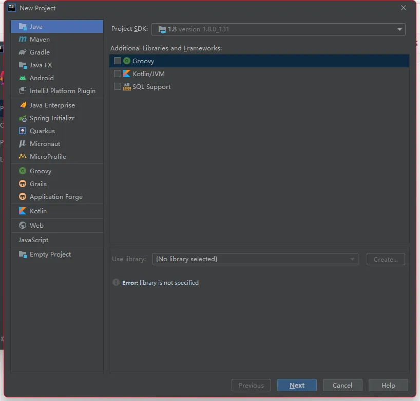
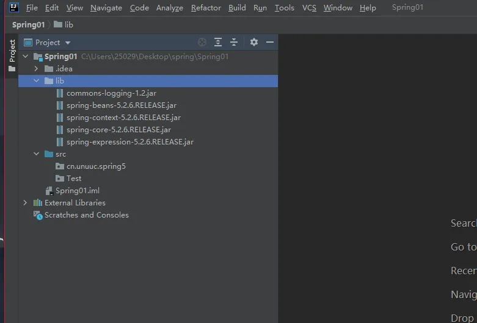
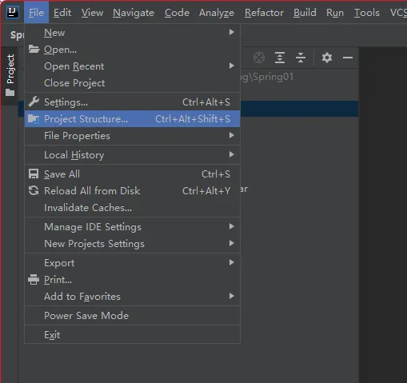
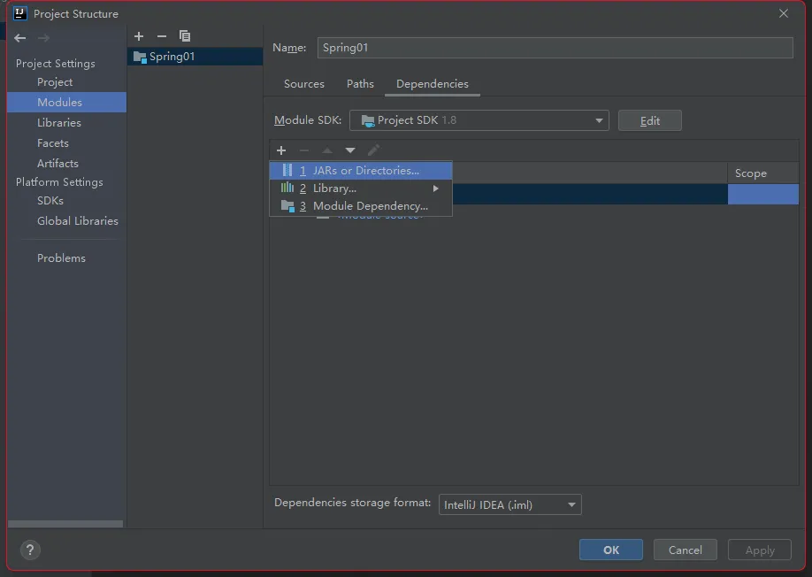
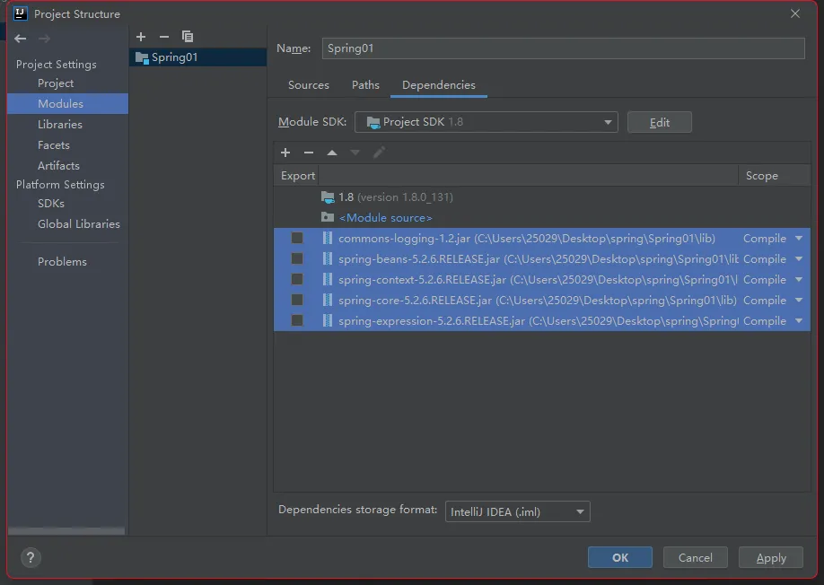
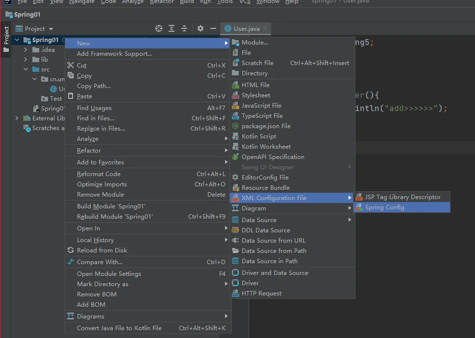
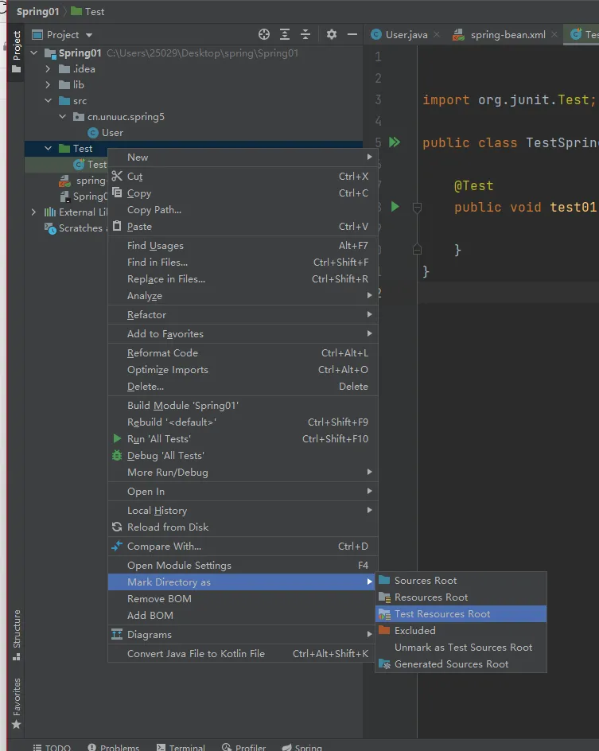
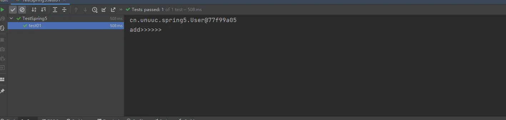

# Spring5入门案例
1. 下载spring jar包
2. 下载commons 包
3. 创建Java项目
4. 导入Spring核心包和commons
5. 测试
## 创建Java项目


## 创建lib目录，将需要的包复制进去


## 将lib目录中的jar包添加到项目依赖中



## 创建User类
```java
package cn.unuuc.spring5;

public class User {
    
    public void addUser(){
        System.out.println("add>>>>>>");
    }
}
```
## 创建spring-bean配置文件
**注意：spring-bean.xml文件所在的位置，在获取配置文件时所使用的方法将不同，建议放在src目录下**



## 编写spring-bean.xml文件,创建user对象
```xml
<?xml version="1.0" encoding="UTF-8"?>
<beans xmlns="http://www.springframework.org/schema/beans"
       xmlns:xsi="http://www.w3.org/2001/XMLSchema-instance"
       xsi:schemaLocation="http://www.springframework.org/schema/beans http://www.springframework.org/schema/beans/spring-beans.xsd">

    <bean id="user" class="cn.unuuc.spring5.User"></bean>
</beans>
```
## 创建测试文件夹，将文件夹设置为Test
注册文件夹的位置，上面图片不对



## 创建测试类,编写测试内容
```java
import cn.unuuc.spring5.User;
import org.junit.Test;
import org.springframework.context.ApplicationContext;
import org.springframework.context.support.ClassPathXmlApplicationContext;

public class TestSpring5 {

    @Test
    public void test01(){
        //1 获取spring-bean配置文件
        ApplicationContext context = new ClassPathXmlApplicationContext("spring-bean.xml");

        //2 通过xml创建对象
        User user = context.getBean("user", User.class);

        System.out.println(user);
        user.addUser();
    }
}
```



如果spring-bean.xml在src目录下，则使用
```java
ApplicationContext context = new ClassPathXmlApplicationContext("spring-bean.xml");
```
如果spring-bean.xml在项目根目录下，则使用
```java
ApplicationContext context = new FileSystemXmlApplicationContext("spring-bean.xml");
```
