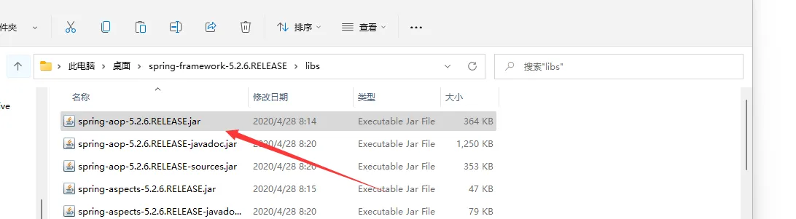
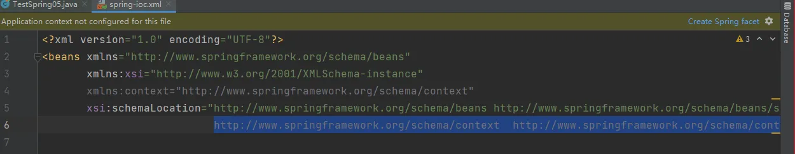
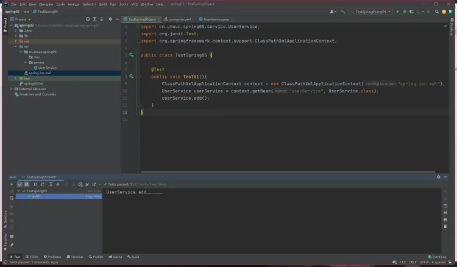
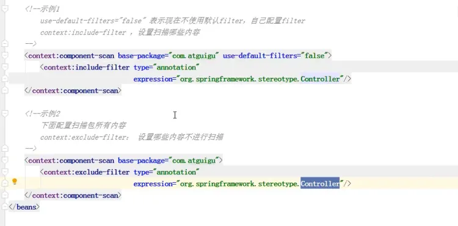

# IOC (注解 bean 管理) 创建对象

## 注解
1. 注解是代码特殊标记，格式：@注解名称（属性名称 = 属性值， 属性名称 = 属性值……）
2. 使用注解，注解作用在类上面，方法上面，属性上面
3. 使用注解目的：简化xml配置
## spring针对bean管理中创建对象提供注解

1. `**@Component**`** **
2. `**@Service**`** **
3. `**@Controller**`** **
4. `**@Repository**`** **

**上面四个注解功能是一样的，都可以用来创建bean实例**
## 基于注解方式实现对象创建
一、引入AOP依赖




二、 开启组件扫描、告诉spring容器，指定扫描包中的类
**引入命名空间**
```xml
xmlns:context="http://www.springframework.org/schema/context"

http://www.springframework.org/schema/context  http://www.springframework.org/schema/context/spring-context.xsd
```

**在配置文件中开启组件扫描**
```xml
<?xml version="1.0" encoding="UTF-8"?>
<beans xmlns="http://www.springframework.org/schema/beans"
       xmlns:xsi="http://www.w3.org/2001/XMLSchema-instance"
       xmlns:context="http://www.springframework.org/schema/context"
       xsi:schemaLocation="http://www.springframework.org/schema/beans http://www.springframework.org/schema/beans/spring-beans.xsd
                           http://www.springframework.org/schema/context  http://www.springframework.org/schema/context/spring-context.xsd">

    <!--开启注解扫描-->
    <context:component-scan base-package="cn.unuuc.spring05"></context:component-scan>
</beans>
```

1. 如果扫描多个包，多个包之间用逗号隔开
2. 扫描多个包的上层目录

三、创建类，在类上添加注解创建对象
```java
package cn.unuuc.spring05.service;

import org.springframework.stereotype.Component;
// 注解里面的value可以省略，默认值为类名称首字母小写
@Component(value = "userService") //等价于 <bean id = "userService" class="……"/>
public class UserService {
    public  void add(){
        System.out.println("UserService add………………");
    }
}
```
**四个注解都可以完成对象的创建**

四、测试



# 过程分析

1. 加载配置文件
2. 在配置文件中有开启组件扫描配置，会扫描包中的所有类
3. 如果类上有相关的注解，则创建对象
# 组件扫描配置细节



